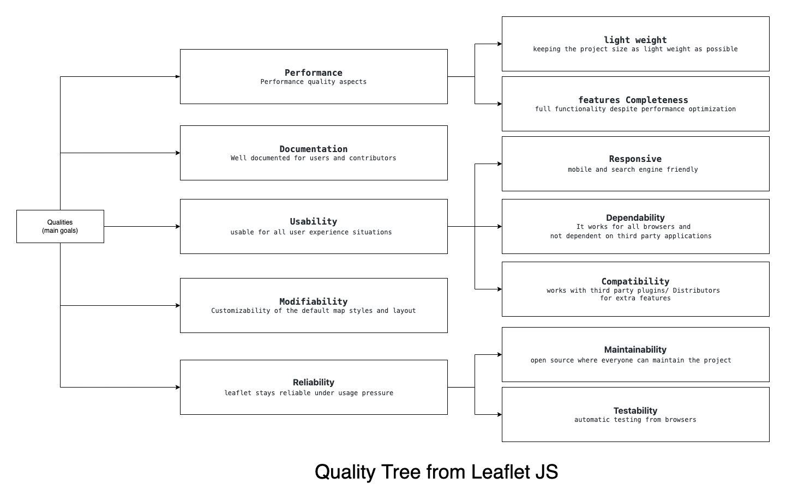

# TABLE OF CONTENTS

1. [Introduction](#introduction)
   1. [Functionalities](#functionalities)
   2. [Main goals](#main-goals)
2. [Stakeholders](#stakeholders)
3. [Requirements](#requirements)
   1. [User Requirements](#user-requirements)
   2. [Programmer Requirements](#programmer-requirements)
   3. [System Requirements](#system-requirements)
4. [Outlook](#outlook)
5. [Glossary](#glossary)

## Introduction

Leaflet is a simple, lightweight JavaScript Library to enable simple handling for interactive Maps.  It is used by many large Corporations such as GitHub, Etsy, Facebook, etc.
In Part 1 of our project, we roughly compiled and formulated the requirements of Leaflet.
Since the requirements are not formulated in Leaflet, we have set ourselves the goal of making the requirements understandable as our contribution, so that certain design decisions are more comprehensible and lead to be incorporated into a uniform architecture. 

[comment]: <> (Leaflet is a simple, performant, lightweight JavaScript Library to enable simple handling 
for interactive Maps. This Document defines several Requirements that shall be satisfied by Leaflet. 
Those Requirements are created by Reengineering since Leaflet has no Requirements and Analysis till Version 1.8.0 and only 
provides Documentation about the API for Devs. We aim to improve this by Contributing to the Project so that those Requirements get more clear for every new
Developer so that they easily understand why certain design decisions were made. It also helps to maintain the Code in a better way.
Leaflet sets its target 100% on simplicity and performance. This said we will always keep it in mind when making any decisions about refactoring code.
It is said that Leaflet is used by many large Corporations such as GitHub, Etsy, Facebook, etc. Because it is a widespread project, it is needed to have 
a flawless Documentation of every development step.)

### Functionalities

-	Creating lightweight maps in simple readable code.
-	customizable with different styles and themes.
-	responsiveness for all devices.

### Main goals (Quality aspects)

-	**Performance:**
Leaflet Js focuses mainly on performance and displaying the features in most appealing way with as less weight as possible.
	-	**Light weight:** Leaflet JS runs as lightweight as possible while maintaining all map functionality. It does that by optimizing the algorithms and the graphics and even cutting as much unused or dead code as possible from the source code reaching about 39 KB of JS and 4 KB of CSS.
	-	**feature Completeness:**
Even though Leaflet JS seeks to improve efficiency and reduce the size of the code required, it provides all the interactive mapping functionality that most developers would ever require.
-	**Documentation** 
The project is well documented for users and contributors.
-	**Usability:**
Leaflet Js focuses mainly on performance and displaying the features in most appealing way with as less weight as possible.
	-	**Responsiveness:** Leaflet shrinks and expands map elements to provide a variety of mobile-friendly displays. To get good readability results from the Google search engine, the library provides lightweight graphs and cutting-edge loading time (SEO optimized).
	-	**compatibility:**
Leaflet JS have a great ability to work with third party plugins support and have a welcoming community for contributors and maintainers.
	-	**Dependability:**
Leaflet JS can work with different browsers with different JS frameworks.
-	**Modifiability:**
Leaflet maps can be modified in many ways.
	-	**Elements modifiability:**
Even though Leaflet JS seeks to improve efficiency and reduce the size of the code required, it provides all the interactive mapping functionality that most developers would ever require.
	-	**Style modifiability:**
Even though Leaflet JS seeks to improve efficiency and reduce the size of the code required, it provides all the interactive mapping functionality that most developers would ever require.
-	**Reliability:**
Leaflet stays reliable under usage pressure. It does that by:
	-	**Maintainablity:**
Since it is an open source project and has a scalable architecture, it has a high level of adaptation to any new issue in the project.
	-	**Testability:**
Leaflet can be tested automatically from browsers thanks to its modularity and scalable architecture.

Various Quality Aspects are defined in the following Quality - Tree. The First Layer from the tree define the bigger goals for leaflet and the leafs of the tree are a bit more precise. The leafs get even more precise in the Requirements. 

> NOTE: Mapping the leafs of the quality-tree to the requirements is directly mentioned in the requirement-tables.

## Stakeholders

Leaflet is strongly aimed to satisfy the Developer's needs. Nonetheless, the Library defines two Stakeholders. Those are the Users who will see the Effects of Leaflet and the Developers who will
use Leaflet for their projects. Users will see effects from Leaflet through a Browser or any Project based on JavaScript. Users want Leaflet because it provides all the functions you would need on a map in your browser. Additionally, it is lightweight so a User will enjoy the library without even noticing that extra libraries were loaded.
Developers will use Leaflet in their Projects because it provides an easy Interface to use Maps in projects and is also independent of the runtime since it is written in JavaScript so the developers don't have to care about System-Dependencies. Leaflet is a standalone Library so Leaflet will enhance the development process for developers.

Enduser :
Enduser is a natural or legal person who ultimately uses or is expected to use a product. End users usually do not have the technical understanding or skills of product developers. End users often do not know much about how the products or services they use were developed or how they work.
In a literal sense, the term end user is used to distinguish the person who purchases and uses the good or service from the people involved in the design, development, and production phases.
The end user can use maps in Leaflet without programming knowledge ,Simple, powerful and user-friendly.
can show the end user the location of a place, village or city. They also help us show physical features of the earth or countries such as mountains, rivers, etc. They also show the political boundaries of states, nations or continents.

Developer :
A developer is an individual that builds and creates software and applications. He or she writes, debugs and executes the source code of a software application.
A developer is also known as a software developer, computer programmer, programmer, software coder or software engineer.
A developer  may be a company or person that creates software - either completely, or with other companies or people. 
Leaflet allows developers without a GIS background to very easily display tiled web maps hosted on a public server, with optional tiled overlays. 

## Requirements

Requirements are split into 3 Parts. Those reflect the different views on Leaflet. 
The first two Parts are based on User Requirements. Users are split into two groups, User and Developer.
Starting with User-Requirements we cover the needs from the User's perspective. It is said that User means here the real user
such as those who will see the results of this library. Followed by the Programmer-Requirements, here are all needs a developer would love to have in the project. Divided from this we have the third Category, technical-Requirements. 
System-Requirements include mostly Requirements needed by Developers but not in a way they will be affected by it directly. 
> Note: Some Requirements belong together from different perspectives but are formulated differently from each perspective, they are marked together in the Column Tracing.

### User Requirements
<!-- markdownlint-disable-->
| # of user Requirement | User Requirement | Type | Tracing |
|-----------------|--------------------|--------------------|--------------------|
| U1 | As a User, I want to Zoom in/out of the map, and Elements should hold their relative Position | Functional (Usability) |  |
| U2 | As a User, I want to use Maps with Leaflet independent of my browser | Quality (Usability & Portability)  | T4 & T5 |
| U3 | As a User, I want to see no differences between Elements from Leaflet in different Browsers | Quality (Dependability) | T5 |
| U4 | As a User, I want to have no extra loading/initialization times (no big computation times) | Quality (Performance)  | |
| U5 | As a User, I want to have responsive design | Quality (Usability) | P2 |
| U6 | As a User, I want to have responsive controls (touchscreen/mouse differ in the way of use) | Quality (Usability) | P2 |
| U7 | As a User, I want to have a fast reset to original map settings | Functional (Usability) | |
| U8 | As a User, I want to switch between metrical and imperial scale | Functional (Portability)| |

<!-- markdownlint-enable-->
### Programmer Requirements
<!-- markdownlint-disable-->
| # of Programmer Requirement | Programmer Requirement | Type | Tracing |
|-----------------|--------------------|--------------------|--------------------|
| P1 | As a Programmer, I want to implement different Map-Types such that Leaflet works the same way with different Maps | Functional | |
| P2 | As a Programmer, I want to include Animations with or without CSS | Functional | U5 & U6 |
| P3 | As a Programmer, I want to make Elements draggable/movable | Functional | |
| P4 | As a Programmer, I want to Organize Elements in Layers | Functional | |
| P5 | As a Programmer, I want to Overlap the Map with Images/Videos/SVG | Functional | |
| P6 | As a Programmer, I want to have build-in functionality for different geometric objects (Lines, Polygons, Squares) | Functional | |
| P7 | As a Programmer, I want to Control the Opacity, Thickness, Color, etc for geometric Objects | Functional | |
| P8 | As a Programmer, I want to merge those geometric objects into bigger ones | Functional | |
| P9 | As a Programmer, I want to define Points with Koordinates in the Map | Functional | |
| P10 | As a Programmer, I want to add EventListeners to Elements and the Map itself | Functional | |
| P11 | As a Programmer, I want to have Mod/Plugin Support for Leaflet Library | Functional | T3 |
<!-- markdownlint-enable-->
### System Requirements
<!-- markdownlint-disable-->
| # of Technical Requirement | Technical Requirement | Type | Tracing |
|-----------------|--------------------|--------------------|--------------------|
| T1 | The System must have 0 dependencies | Constraint | T3 & T6 |
| T2 | The System must be lightweight | Constraint | |
| T2 | The System must have a minimal code-base | Constraint | |
| T3 | The System must support plugins (for additional features) | Functional & Quality (maintainability) | P11 & T1 |
| T4 | The System must work on any platform that supports JS (Vanilla JS) | Quality  (Dependability) | T5 & U2|
| T5 | The System must work regardless of Browser | Quality (Dependability) | T4 & U2 & U3|
| T6 | The System must be deployable internal and external (JS-File or loaded from a CDN) | Constraint | T1 |
| T7 | The System must have simple, readable source code | Quality (Maintainability) | |
| T8 | The System must support different Map-Distributors such as Google, OpenStreetMap, Bing, etc. | Quality (Compatibility) | |
| T9 | The System must be exportable as a single JS File | Functional | |
| T10 | The System must support automatic testing for several browsers | Quality (testability) | |
| T11 | The System must have his Sourcecode avaiable with a Open-Source System in github.com | Quality (maintainability) | |

<!-- markdownlint-enable-->
## Outlook
<!-- markdownlint-disable-->

Because the process of defining, documenting and maintaining requirements in this project is missing we have the target to contribute to the project this missing piece. Our Contribution should enhance the whole Requirement Process. We want to help new Developers too easily understand designing decisions and also offer experienced developers a place to come back and get their minds straight for the goal of Leaflet. The first Contribution will be that this scoping_document will be translated into an HTML File which can be merged into the leafletjs.com Website in the Docu Part.
Leaflet also has over 300 issues on its GitHub, we plan to support the team with some bug fixes. 

<!-- markdownlint-enable-->
## Glossary
<!-- markdownlint-disable-->
| Term | Meaning | 
|-----------------|--------------------|
| JavaScript | The Programming Language Leaflet uses |
| Stakeholder | Person or Group involved in the usage of Leaflet |
| CDN | Content Delivery Network - deliver Code or Text fast from a Network of Servers |
| Requirement(s) | Wishes and Needs for the project |
| Vanilla JS | JavaScript out-of-the-box without any dependencies |
| Mod / Plugin | Code that improves Leaflet without belonging to the Core of Leaflet |
| Layer | a theme or overlay of the map |
| popup | an information window that opens in the viewing frame of the map |
| marker | a pin or an image that marks geographical locations on the map |
| Tooltip | a window the same as a popup but for the locations |
| Dependence | Libraries or Plugins from third-party providers |
| End user | A person who interacts with the product with the intention of only using the product for his needs |
| Developer | A person who interacts with the product with the intention of using the product for his needs and contribution to the development of the product |
