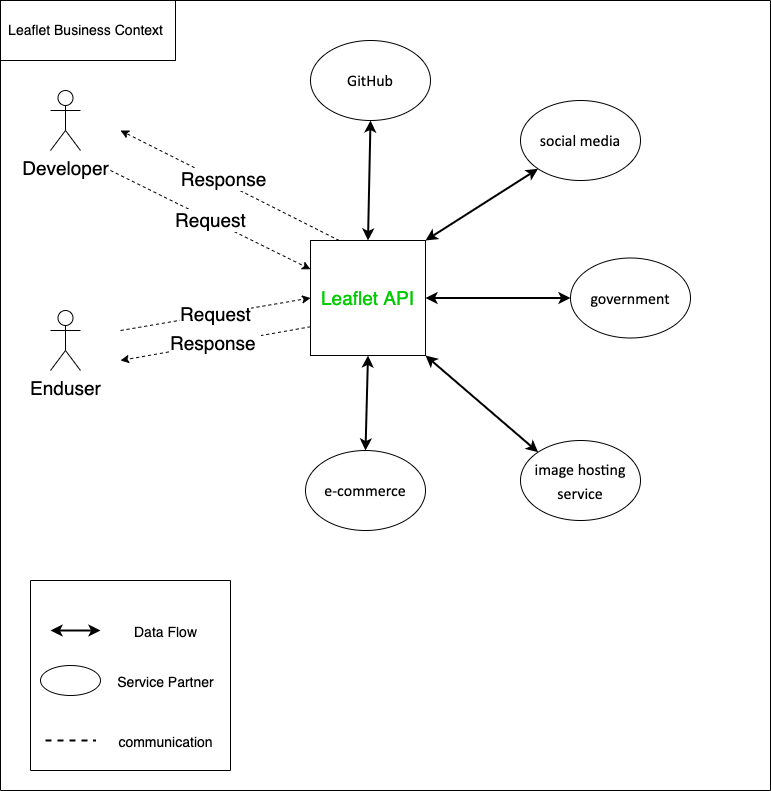
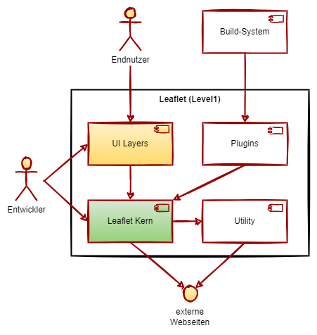
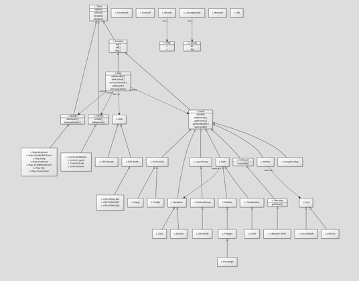
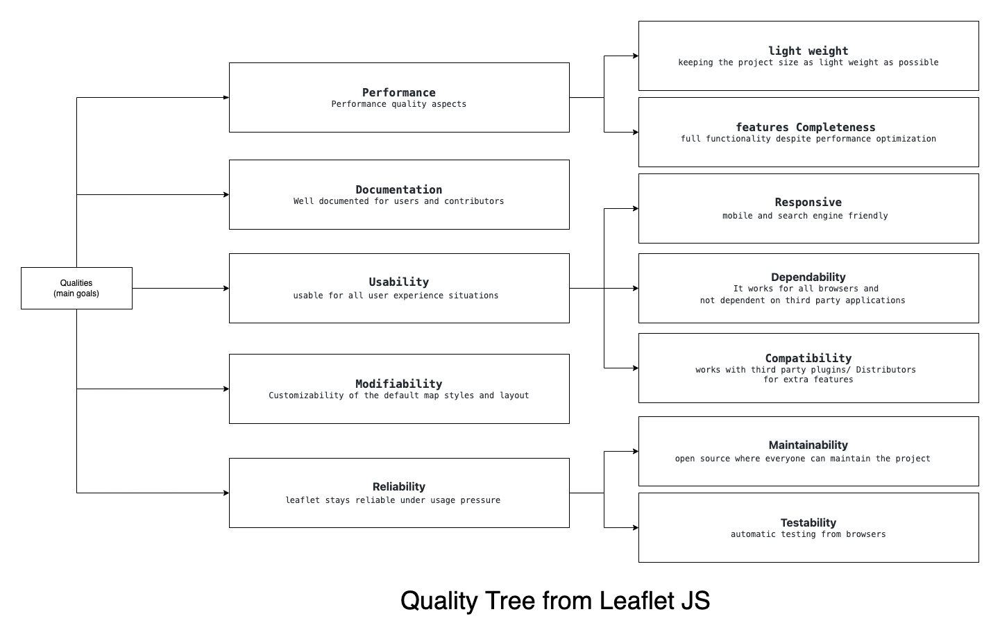

# Einführung und Ziele {#section-introduction-and-goals}

Beschreibt die wesentlichen Anforderungen und treibenden Kräfte, die bei
der Umsetzung der Softwarearchitektur und Entwicklung des Systems
berücksichtigt werden müssen.

Dazu gehören:

-   zugrunde liegende Geschäftsziele,
-   wesentliche Aufgabenstellungen,
-   wesentliche funktionale Anforderungen,
-   Qualitätsziele für die Architektur und
-   relevante Stakeholder und deren Erwartungshaltung.

## Aufgabenstellung {#_aufgabenstellung}

::: formalpara-title
**Inhalt**
:::

Kurzbeschreibung der fachlichen Aufgabenstellung, treibenden Kräfte,
Extrakt (oder Abstract) der Anforderungen. Verweis auf (hoffentlich
vorliegende) Anforderungsdokumente (mit Versionsbezeichnungen und
Ablageorten).

::: formalpara-title
**Motivation**
:::

Aus Sicht der späteren Nutzung ist die Unterstützung einer fachlichen
Aufgabe oder Verbesserung der Qualität der eigentliche Beweggrund, ein
neues System zu schaffen oder ein bestehendes zu modifizieren.

::: formalpara-title
**Form**
:::

Kurze textuelle Beschreibung, eventuell in tabellarischer Use-Case Form.
Sofern vorhanden, sollte die Aufgabenstellung Verweise auf die
entsprechenden Anforderungsdokumente enthalten.

Halten Sie diese Auszüge so knapp wie möglich und wägen Sie Lesbarkeit
und Redundanzfreiheit gegeneinander ab.

Siehe [Anforderungen und Ziele](https://docs.arc42.org/section-1/) in
der online-Dokumentation (auf Englisch!).

## Qualitätsziele {#_qualit_tsziele}

::: formalpara-title
**Inhalt**
:::

Die Top-3 bis Top-5 der Qualitätsanforderungen für die Architektur,
deren Erfüllung oder Einhaltung den maßgeblichen Stakeholdern besonders
wichtig sind. Gemeint sind hier wirklich Qualitätsziele, die nicht
unbedingt mit den Zielen des Projekts übereinstimmen. Beachten Sie den
Unterschied.

Hier ein Überblick möglicher Themen (basierend auf dem ISO 25010
Standard):

::: formalpara-title
**Motivation**
:::

Weil Qualitätsziele grundlegende Architekturentscheidungen oft
maßgeblich beeinflussen, sollten Sie die für Ihre Stakeholder relevanten
Qualitätsziele kennen, möglichst konkret und operationalisierbar.

::: formalpara-title
**Form**
:::

Tabellarische Darstellung der Qualitätsziele mit möglichst konkreten
Szenarien, geordnet nach Prioritäten.

## Stakeholder {#_stakeholder}

::: formalpara-title
**Inhalt**
:::

Expliziter Überblick über die Stakeholder des Systems -- über alle
Personen, Rollen oder Organisationen --, die

-   die Architektur kennen sollten oder

-   von der Architektur überzeugt werden müssen,

-   mit der Architektur oder dem Code arbeiten (z.B. Schnittstellen
    nutzen),

-   die Dokumentation der Architektur für ihre eigene Arbeit benötigen,

-   Entscheidungen über das System und dessen Entwicklung treffen.

::: formalpara-title
**Motivation**
:::

Sie sollten die Projektbeteiligten und -betroffenen kennen, sonst
erleben Sie später im Entwicklungsprozess Überraschungen. Diese
Stakeholder bestimmen unter anderem Umfang und Detaillierungsgrad der
von Ihnen zu leistenden Arbeit und Ergebnisse.

::: formalpara-title
**Form**
:::

Tabelle mit Rollen- oder Personennamen, sowie deren Erwartungshaltung
bezüglich der Architektur und deren Dokumentation.

+-----------------+-----------------+-----------------------------------+
| Rolle           | Kontakt         | Erwartungshaltung                 |
+=================+=================+===================================+
| *\<Rolle-1>*    | *\<Kontakt-1>*  | *\<Erwartung-1>*                  |
+-----------------+-----------------+-----------------------------------+
| *\<Rolle-2>*    | *\<Kontakt-2>*  | *\<Erwartung-2>*                  |
+-----------------+-----------------+-----------------------------------+

# Randbedingungen {#section-architecture-constraints}

## Technical constraints

### Leaflet muss sein:

•	plattformunabhängig und auf allen wichtigsten Betriebssystemen und Browsern laufen.

•	Einheitliche Oberfläche.

•	Entwicklung mit JavaScript. sollte auch in neueren Java-Versionen laufen, sofern verfügbar.

•	intern und extern eingesetzt werden können (JS-Datei oder von einem CDN geladen).

•	eine minimale Codebasis haben.

•	Das geschriebene Quellcode auskommentiert werden.

•	Nach jedem Beitrag gut getestet.

•	Handelt es sich um Drittsoftware (z. B. ein grafisches Frontend), sollte diese idealerweise frei verfügbar und kostenlos sein.

## Organizational constraints

### Es muss:

•	Die Beiträge aus den Leaflet issues sein.

•	Nach der team-entscheidung wird ausgewähltes issues bearbeitet.

•	Die Entscheidung von der Anzahl der Entwickler für jeden Beitrag, durch team -Meeting getroffen.  

•	Die Bearbeitungszeit, vom team gesetzt.  

•	für Jeden Beitrag entsprechende Dokumentation – Berichte erstellen.

•	Der Quellcode der Lösung, oder zumindest Teile davon, werden als Open Source zur Verfügung gestellt.

•	Beginn der Entwicklung am Anfang Juli 2022. Fertigstellung des Beitrags am Ende Juli 2022.

# Kontextabgrenzung {#section-system-scope-and-context}

## Business Kontext

| **Nachbaren** | **Beschreibung** |
|-----------------------|-----------------------------------------------|
| *Enduser* | *ist eine natürliche oder juristische Person, die Leaflet map letztendlich benutzt.* |
| *Developer* | *,die Leaflet für ihre Projekte verwenden werden* |
| *Leaflet API* | *JavaScript library* |
| *Github* | *ist ein Anbieter von Internet-Hosting für Softwareentwicklung und Versionskontrolle mit Git.* |
| *Social media* | *sind digitale Medien bzw. Plattformen wie Facebook* |
| *Government* | *government  website. Wie data.gov* |
| *Image hosting service* | *ist ein kommerzieller Onlinedienst mit Community-Elementen, der es Benutzern erlaubt, digitale und digitalisierte Bilder zu laden und zu teieln, wie 500px und Flickr* |
| *e-commerce* | *Internethandel, Onlinehandel Website für den Kauf und Verkauf von Waren. wie etsy* |

## Technischer Kontext

| **Aktor** | **Beschreibung** |
|-----------------------|-----------------------------------------------|
| *Enduser* | *ist eine natürliche oder juristische Person, die Leaflet map letztendlich benutzt.* |
| *Developer* | *,die Leaflet für ihre Projekte verwenden werden* |
| *Mobile* | *mobilephone* |
| *Tablet/ipad* | *ist ein tragbarer, flacher Computer in besonders leichter Ausführung mit einem Touchscreen* |
| *Computer** | *Hier werden alle Computersorte gemeint, wie Desktop, laptop, server ……* |
| *Leaflet API server* | *Wo Quellecode gespeichert ist.* |
| *Leaflet Pulings databdase* | *Repo, wo alle Pulings gespeichert sind.* |

# Lösungsstrategie {#section-solution-strategy}

### Algemeine Ausblick 

Wir arbeiten in kleiner Gruppe aus 4 Entwickler, durch Reverse Engineering haben wir die  Requirements herausgefunden. 
Wir haben möglichst versucht, unsere Architektur auf den Funktionsanforderungen zu basieren und sie gut zu dokumentieren.
In diesem Dokument haben wir präzisier und ausführlich erklärt, wie unsere gefolgte Politik aussieht.

| **Qualitätsziel** | **Lösungsansatz** |**Details** |
|-----------------------|-----------------------------------------------|---------------------------|
| *Performance* | *Anzeige von beweglichen Icons auf der Karte* |*Qualitätsbaum -> Performance*|
| *light-weight* | *der Code sollte so klein wie möglich sein* |*Qualitätsbaum -> Performance -> light-weight*|
| *feature Completeness* | *sollte alle notwendigen Funktionen enthalten* |*Qualitätsbaum -> Performance ->feature Completeness*|
| *Documentation* | *•	Klassendiagramm   •  Geschäftsprozessdiagramm   •	Kontextdiagramm •	Verfügbare Dokumentation für alle Funktionen •	Beispielprojekte*|*Qualitätsbaum -> Documentation*|
| *Usability* | *•	Sichern, dass Benutzer Karte benutzen kann. •	Sichern, dass Benutzer mit der Karte reagieren kann.* |*Qualitätsbaum -> Usability*|
| *Responsive* | *Sollte durch JS und CSS auf allen Oberflächen anpassen* |*Qualitätsbaum -> Usability-> Responsive*|
| *Dependability* | *kann unabhängig vom Browser Leaflet nutzen* |*Qualitätsbaum -> Usability-> Dependability*|
| *Compatibility* | *•	zahlreiche Plugin ergeben neue Funktionen. •	Gut dokumentiert.* |*Qualitätsbaum -> Usability-> Compatibility*|
| *Modifiabilty* | *•	Durch CSS kann die Elemente ändern.* |*Qualitätsbaum -> Modifiabilty*|
| *Maintainability* | *•	Open Source, so jeder an der Bearbeitung teilnehmen kann  •	Gut dokumentiert.* |*Qualitätsbaum -> Reliability-> Maintainability*|
| *Testability* | *•	Sollte ausreichende Testen ausgeführt werden* |*Qualitätsbaum -> Reliability-> Testability*|

-   Technologieentscheidungen

-   Entscheidungen über die Top-Level-Zerlegung des Systems,
    beispielsweise die Verwendung gesamthaft prägender Entwurfs- oder
    Architekturmuster,

-   Entscheidungen zur Erreichung der wichtigsten Qualitätsanforderungen
    sowie

-   relevante organisatorische Entscheidungen, beispielsweise für
    bestimmte Entwicklungsprozesse oder Delegation bestimmter Aufgaben
    an andere Stakeholder.

::: formalpara-title
**Motivation**
:::

Diese wichtigen Entscheidungen bilden wesentliche „Eckpfeiler" der
Architektur. Von ihnen hängen viele weitere Entscheidungen oder
Implementierungsregeln ab.

::: formalpara-title
**Form**
:::

Fassen Sie die zentralen Entwurfsentscheidungen **kurz** zusammen.
Motivieren Sie, ausgehend von Aufgabenstellung, Qualitätszielen und
Randbedingungen, was Sie entschieden haben und warum Sie so entschieden
haben. Vermeiden Sie redundante Beschreibungen und verweisen Sie eher
auf weitere Ausführungen in Folgeabschnitten.

Siehe [Lösungsstrategie](https://docs.arc42.org/section-4/) in der
online-Dokumentation (auf Englisch!).

<!--- ab hier Franziskas Part -->
# Bausteinsicht

## Whitebox Gesamtsystem

### Begründung

Bei der Nutzung von Leaflet steht die API im Vordergrund, dadurch ist es naheliegend diese als Whitebox für die Gesamtstruktur zu wählen. Für die Blackboxen wurde die interne Ordnerstruktur des Quellcodes gewählt, auf interne Schnittstellen jedoch verzichtet, zwecks Übersicht und mangelnder Wichtigkeit. Weiter wird die Möglichkeit der Plugin-Nutzung aufgezeigt, tatsächlicher Einfluss auf die einzelnen Komponenten hängt jedoch von den gewählten Plugins ab. Des Weiteren wird der Externe Zugriff von Websites, Software und Apps dargestellt. Auf eine weitere Abstraktion wurde verzichtet, da auf der nächst höheren Ebene nicht mehr Leaflet, sondern die externe Website, Software oder App im Vordergrund stünde.

| **Baustein** | **Beschreibung** |
|-----------------------|-----------------------------------------------|
| *Leaflet.js* | *Gewährt Zugriff auf Klassen und Funktionen von Leaflet* |
| *control* | *Gewährleistet die Kartesteuerung* |
| *core* | *Basisklassen, -funktionen und -methoden* |
| *dom* | *DOM-Events und -Funktionen* |
| *geo* | *Darstellung und Projektion geographischer Gegebenheiten * |
| *geometry* | *Darstellung und Handhabung geometrischer Strukturen* |
| *layer* | *Bereitstellung von Funktionen, die die Darstellung der Karte und Zusatzinformationen auf verschiedenen Ebenen gewährleistet* |
| *map* | *Erstellung und Manipulation der Karte* |

### \blackbox (optional)

*\<Zweck/Verantwortung>*

*\<Schnittstelle(n)>*

*\<(Optional) Qualitäts-/Leistungsmerkmale>*

*\<(Optional) Ablageort/Datei(en)>*

*\<(Optional) Erfüllte Anforderungen>*

*\<(optional) Offene Punkte/Probleme/Risiken>*

## Ebene 2

### Whitebox *\<control>*

[Übersichtsdiagramm](ebene2_control_building_blocks.png)

| **Baustein** | **Beschreibung** |
|-----------------------|-----------------------------------------------|
| *Attribution* | *Anzeige von Attributionsdaten in kleinen Textboxen * |
| *Layers* | *Wechsel zwischen verschiedenen Basisebenen sowie das An- und Ausschalten von Overlays* |
| *Scale* | *Steuerung der Skalierung* |
| *Zoom* | *Steuerung der Zoofunktions* |
| *Control* | *Basisklasse für die Kartensteuerung, handhabt Positionierung* |

### Whitebox *\core*

[Übersichtsdiagramm](ebene2_core_building_blocks.png)

| **Baustein** | **Beschreibung** |
|-----------------------|-----------------------------------------------|
| *Browser* | *Browser- und Featureerkennung * |
| *Class* | *Basisklasse* |
| *Events* | *Sammlung von Methoden für eventbasierte Klassen* |
| *Handler* | *Basisklasse für Handler* |
| *Util* | *Samlung von Utility-Funktionen* |

### Whitebox *\dom*

[Übersichtsdiagramm](ebene2_dom_building_blocks.png)

| **Baustein** | **Beschreibung** |
|-----------------------|-----------------------------------------------|
| *DomEvent.DoubleTap* | *Doppelklick-Spport für mobile Browser* |
| *DomEvent.Pointer* | *Touch-Support für Internet Explorer und Windowsbasierte Geräte* |
| *DomEvent* | * Sammlung von Utility-Funktionen, die mit DOM-Events arbeiten* |
| *DomUtil* | *Sammlung von Utility-Funktionen, die mit DOM arbeiten* |
| *Draggable* | *Klasse, die Dom-Elemente verschiebbar macht* |
| *PosAnimation* | *Interne Nutzung für Schwenkanimationen * |

### Whitebox *\geo*

[Übersichtsdiagramm](ebene2_geo_building_blocks.png)

| **Baustein** | **Beschreibung** |
|-----------------------|-----------------------------------------------|
| *crs* | *Koordinaten-Referenz-System: Projektion von geographischen Punkten zu Pixel-Koordinaten und zurück* |
| *projection* | *Projektion von Längen- und Breitengraden auf der Karte* |
| *LatLng* | *Repräsentation eines geographischen Punktes mit einem bestimmten Längen- und Breitengrad* |
| *LatLngBounds* | *Repräsentation eines rechteckigen geographischen Gebietes auf der Karte* |

### Whitebox *\geometry*

[Übersichtsdiagramm](ebene2_geometry_building_blocks.png)

| **Baustein** | **Beschreibung** |
|-----------------------|-----------------------------------------------|
| *Bounds* | *Repräsentiert rechteckiges Gebiet in Pixel-Koordinaten* |
| *LineUtil* | *Verschiedene Untility-Funktionen zur Verarbeitung von Polylinienpunkten* |
| *Point* | *Repräsentiert Punkt mit Pixel-Koordinaten* |
| *PolyUtil* | *Verschiedene Utility-Kunktionen für polygonale Geometrien * |
| *Transformation* | *affine Transformation (x,y) <--> (a*x + b, c*y + d)* |

### Whitebox *\layer*

[Übersichtsdiagramm](ebene2_layer_building_blocks.png)

| **Baustein** | **Beschreibung** |
|-----------------------|-----------------------------------------------|
| *marker* | *Anzeige von beweglichen Icons auf der Karte* |
| *tile* | *Laden und Anzeigen von Kachel-Ebenen auf der Karte* |
| *vector* | *Anzeigen von Vektorebenen, erlaubt das Zeichnen von Vektor-Overlays* |
| *DivOverlay* | *Basismodel für Overlays* |
| *FeatureGroup* | *Features werden auf alle Layer einer Gruppe angewendet* |
| *GeoJSON* | *Repräsentiert GeoJson Objekt und analysiert diese und zeigt sie auf der Karte an* |
| *ImageOverlay* | *Lädt und zeigt einzelne Bilder an* |
| *Layer* | *Methoden von der Layer-Basisklasse* |
| *LayerGroup* | *Grupperen von Layern* |
| *Popup* | *Zum Öffnen von Poups an bestimmten stellen auf der Karte* |
| *SVGOverlay* | *Laden, Anzeigen und Bereitstellen vom DOM-Zugang zu SVG-Dateien* |
| *Tooltip* | *Anzeigen von kleinen Texten über den Kartenebenen * |
| *VideoOverlay* | *Laden und Anzeigen von Video-Playern* |

### Whitebox *\map*

[Übersichtsdiagramm](ebene2_map_building_blocks.png)

| **Baustein** | **Beschreibung** |
|-----------------------|-----------------------------------------------|
| *handler* | *Handhabt Umgang mit Eingaben* |
| *map* | *Erstellen und manipulieren der Karte* |

# Laufzeitsicht

Da es sich bei Leaflet um eine Bibliothek handelt, deren implementierung inline erfolgt, gibt es keine Laufzeitansicht. Zumindest keine in erwähnenswerter Komplexität.

# Verteilungssicht

## Infrastruktur

Als Bibliothek vermeidet es Leaflet Anforderungen an Soft- und Hardware zu stellen. Leaflet unterstützt durch die Verwendung von HTML5 und CSS3 die meisten Desktop- und Mobil-Browser. Demenstprechend strebt Leaflet danach, auf möglichst jedem System zu funktionieren. Kurz, Leaflet läuft auf jeder Hardware, die Javasript unterstützt.

<!--- ab hier Toms Part -->
# Querschnittliche Konzepte

In diesem Abschnitt handelt es sich um prinzipielle Regelungen und Lösungsansätze, die beim Aufbau der Bausteine beachtet werden müssen, um die konzeptionelle Integrität der Architektur und die Qualität des Systems zu garantieren. Die Lösungsansätze sind:

-   Modelle, insbesondere fachliche Modelle.
-   Architektur- oder Entwurfsmuster.
-   Regeln für den konkreten Einsatz von Technologien.
-   Prinzipielle - oder technische Festlegungen übergreifender Art.
-   Implementierungsregeln

Basierend auf dem, was in den vorherigen Kapiteln abgeglichen wurde, und unter Berücksichtigung der Architektur der Bausteine, werden wir diese Regelungen und Lösungsansätze betrachten.

Siehe [Querschnittliche Konzepte](https://docs.arc42.org/section-8/) in
der online-Dokumentation (auf Englisch).

## Fachliche Konzepte

Die fachliche- oder Domänenkonzepte sind eine Reihe von Modellen und Konzepten, die in den Benutzerverwaltungsbausteinen und Schnittstellen der Authentifizierung in der Architektur eingehalten werden müssen.

Alle Endbenutzer bzw. Entwickler von Leaflet JS brauchen sich nicht zu registrieren oder einzuloggen, um die verschiedene Services nutzen zu können. Das Projekt ist eine Open-Source-UI-Bibliothek für Karten und daher sind keine Bausteine zur Authentifikation oder Benutzerverwaltung benötigt. 

## *Architektur-und Entwurfsmuster* 

Im Blick auf das von Leaflet bereitgestellte Architekturdiagramm ..

Siehe [Leaflet Struktur](https://leafletjs.com/examples/extending/class-diagram.html) in
der Dokumentation von Leaflet (auf Englisch).

wir finden folgendes:
-   Das Leaflet-Team entscheidet sich für die einfache Vererbung (include und extend) für alle Relationen der Projektbausteine in einem logischen Zusammenhäng (z. B. "hat eine" oder "enthält" ).
-   Da die Entwickler das Composite-Konzept noch nicht genutzt haben, schlagen wir vor, mehrere Composites in der Architektur für mehr Modularität hinzuzufügen.
-   Zum Beispiel erben die Module Marker (L.Marker), Path (L.Path), Layer Group (L.LayerGroup) und andere von dem Muttermodul Layer (L.Layer). Da eine Ebene eine andere Ebene erben kann, die ein *Layers group* bildet (das Stapeln mehrerer *Layers* ist möglich), können wir stattdessen eine zusammengesetzte Vorlage (composite template) verwenden:

Hier kann ein *Layer* Pfad, Marker oder ein *Composite* sein.

-   Die Projektmodularität ist ebenfalls logisch und leicht zu erkennen, wobei jede Klasse ein Modul darstellt, insbesondere für Schlüsselbausteine wie *Controller*, *Handler*, *Layer*, *Zoom* oder die Module für die geometrischen Formen.

## User Experience (UX) 

Leaflet verwendet eine intuitive Benutzeroberfläche, um dem Benutzer eine erlernbare und vereinfachte Karte bereitzustellen.

### Internationalisierung

Die einzige unterstützte Sprache ist Englisch. Es gibt keinen Haken für die Internationalisierung im Frontend und es gibt keine Pläne, einen zu erstellen.

## Sicherheitskonzepte 

Da alle Leaflet-Services öffentlich zugänglich sind und keine Authentifizierung enthalten, muss keine Sicherheitskonzepte eingerichtet werden. Der Code kann jedoch nur geändert werden, nachdem er von vertrauenswürdigen Betreuern überprüft wurde. 

## Entwicklungskonzepte 

###  Build & Deploy:

*Leaflet* verwendet CI/CD-Konzepte und *Git* Pipelines, um sicherzustellen, dass alle Funktionen vor jeder Veröffentlichung testbar und funktionsfähig sind.

### Testability
Das Projekt enthält JUnit-Tests am Standardspeicherort jeder Komponente des Projekts. Zum Zeitpunkt des Schreibens decken diese Tests fast den gesamten geschriebenen Code ab. Tests müssen während des Builds ausgeführt werden und sollten nicht übersprungen werden.

### Migration:
Das Projekt hat ein hohes Maß an Flexibilität, da es auf vielen Plattformen bzw. *Browsers* ausgeführt werden kann, was die Migration des Codes von einer Umgebung in eine andere ermöglicht.

### Codegenerierung:
Der Quellcode des Projekts wird nicht durch die Architektur oder Metamodelle generiert. Es wird manuell von *Contributors* und Entwicklern erstellt.

### Konfigurierbarkeit:
Leaflet bietet eine Fülle von Konfigurationsoptionen, mit denen die Benutzererfahrung an die Bedürfnisse des Entwicklers angepasst werden kann. Die Standardkonfiguration ist bei der Initialisierung immer verfügbar unter `map.map.js` , und der Entwickler kann während oder nach der Initialisierung der Karte zusätzliche Eigenschaften hinzufügen. Die Konfigurationsoptionen sind kategorisiert in:

#### Interaktionsmöglichkeiten: 

Allgemeine Konfiguration der Benutzerinteraktion mit dem System. Und das sind hauptsächlich die Optionen, die das Zoomen, das Ansichtsfenster und das Ziehen steuern. Am wichtigsten:

| option  |  type | default  |  description | 
| ------------ | ------------ | ------------ | ------------ |
|  doubleclickzoom | Boolean-String  |  true  | Ob die Karte durch Doppelklick vergrößert und durch Doppelklick verkleinert werden kann |
|  dragging  |  Boolean  |   true |  Ob die Karte per Maus/Berührung ziehbar ist oder nicht. |
|  trackResize  | Boolean    |  true |  Ob die Karte automatisch die Größe des Browserfensters ändert, um sich selbst zu aktualisieren. |

- **Keyboard Navigation Options**
Es konfiguriert, wie der Benutzer mit dem System über die Tastatur interagiert:

| option  |  type | default  |  description |
| ------------ | ------------ | ------------ | ------------ |
|  keyboard |  Boolean  |true | Macht die Karte fokussierbar und ermöglicht Benutzern das Navigieren auf der Karte mit Tastaturpfeilen und +/- Tasten.  |
|  keyboardPanDelta  | Number   |  80 | Anzahl der zu verschiebenden Pixel beim Drücken einer Pfeiltaste.  |

- **Mouse wheel options**
Es konfiguriert, wie der Benutzer mit dem System über die *Mouse wheel* interagiert:

| option  |  type | default  |  description |
| ------------ | ------------ | ------------ | ------------ |
|  scrollWheelZoom  |  Boolean-String | true    | Ob die Karte mit dem Mausrad gezoomt werden kann. Wenn 'center' übergeben wird, zoomt es auf die Mitte der Ansicht, unabhängig davon, wo sich die Maus befindet. | 

#### Map State Options:
Optionen, die steuern, was der Benutzer auf der Karte sieht und wie sich der Status der Karte ändert. Am wichtigsten sind die Optionen:

| option  |  type | default  |  description 
| ------------ | ------------ | ------------ | ------------ |
| layers   | layer []  | []  | Array von Layern, die der Karte anfänglich hinzugefügt werden |
|center | LatLng  |  undefined | Ursprünglicher geographischer Mittelpunkt der Karte |
|  maxZoom  | Number   | *  |  Maximale Zoomstufe der Karte. Wenn nicht angegeben und mindestens ein GridLayer oder TileLayer in der Karte vorhanden ist, wird stattdessen die höchste ihrer maxZoom-Optionen verwendet. |

#### Animation Options:
Konfiguration der verschiedenen Animationsoptionen:

| option  |  type | default  |  description | 
| ------------ | ------------ | ------------ | ------------ |
|  zoomAnimation | Boolean   |   true  | Ob die Karten-Zoom-Animation aktiviert ist. Standardmäßig ist es in allen Browsern aktiviert, die CSS3-Übergänge unterstützen, mit Ausnahme von Android. | 
|  markerZoomAnimation  | Boolean   |  true   | Unabhängig davon, ob Markierungen ihren Zoom mit der Zoom-Animation animieren, verschwinden sie für die Dauer der Animation, wenn sie deaktiviert sind. Standardmäßig ist es in allen Browsern aktiviert, die CSS3-Übergänge unterstützen, mit Ausnahme von Android. | 

> Weitere konfigurierbar Optionen sind **events**, **Marker**, **location** und **zoom**. Unter [leaflet docs](http://leafletjs.com/reference.html "leaflet docs") sind alle Optionen gelistet.

## Unter-der-Haube 

Der Leaflet-Verbesserungsprozess beginnt mit der Erstellung von Issue-Ticks von den Endnutzern bzw. Entwickler an die maintainers.

### Ausnahme-/Fehlerbehandlung:

Die Fehlerbehandlung bei inkonsistenten Daten (in Bezug auf die Einschränkung des Datenmodells) sowie Fehler bei der Validierung werden HTTP-Fehlern zugeordnet (404 code). Diese Fehler werden vom Controller-Code des Frontends behandelt. Technische Fehler (Hardware, Datenbank etc.) werden nicht behandelt und können zu Anwendungsausfällen oder Datenverlust führen.

### Sitzungsbehandlung:

Leaflet.JS bietet nur eine zustandslose öffentliche API, es gibt keine Sitzungsbehandlung.

### Communication/Integration:

Die Kommunikation zwischen den Endbenutzern, Entwicklern und Betreuern findet hauptsächlich im Issues bereich und in den Community-Kanälen statt.

### Plugin Concept and Development

Leaflet-Dienste lassen sich mit Plugins von Drittanbietern integrieren. Das Erstellen und Implementieren eines Plugins ist auf der [Leaflet-Website](https://github.com/Leaflet/Leaflet/blob/main/PLUGIN-GUIDE.md "Leaflet-Website") gut dokumentiert . 

Jedes Leaflet-Plugin sollte die folgende Architektur haben, um sich gut in die Architektur zu integrieren:

    |-- L.MyPlugin
    |--|--|  src  -  JS source files
    |--|--| dist  - minified plugin JS, CSS, images
    |--|--| spec  - test files
    |--|--| lib - any external libraries/plugins if necessary
    |--|--| examples   - HTML examples of plugin usage
    |--|--| README.md
    |--|--| LICENSE
    |--|--| package.json

Für Leaflet wird eine zusätzliche Plugin-API erstellt. Der Zugriff auf Elemente mit einem Plugin kann so einfach sein wie das Aufrufen einer Leaflet-Klasse` L.marker` mit den benutzerdefinierten Funktionen und Optionen des Plugins:

    marker.myPlugin('bla', {
    	optionOne: 'foo',
    	optionThree: 5
    });

Das Plugin sollte auf *NPM* (Node Package Modules Manager) mit spezifischen Metadaten veröffentlicht werden, damit das Plugin mit *Leaflet* kompatibel ist:

    {
      "name": "my-leaflet-plugin",
      "version": "1.0.0",
      "description": "A simple leaflet plugin.",
      "main": "my-plugin.js",
      "author": "You",
      "license": "IST",
      "peerDependencies": {
        "leaflet": "^1.0.0"
      }
    }
	

Das Plugin wird dann von den Maintainers überprüft und der Liste der Leaflet-Plugins hinzugefügt, damit es öffentlich zugänglich ist.

### Parallellisierung/Threading:

Leaflet arbeitet mit einer Single-Thread-Nutzung. Multi-Threading wird nicht unterstützt.

### Geschäftsregeln:

Da es sich um ein Open-Source-Projekt handelt, entspricht dieses Konzept dem contribution Richtlinien sowie die Gebrauchsanweisung in der Dokumentationen.

### Batch & Reporting:

Eine Batch wird als neue Version der leaflet erstellt, mit einem Bericht, der die Verbesserungen in dieser Batch erläutert.

## Betriebskonzepte

### Hochverfügbarkeit:

Die Popularität des Projekts verschafft *Leaflet* eine Armee gut ausgebildeter Betreuer und Benutzer, die Probleme schnell erkennen und darauf reagieren können, und dies ist der Grund für die zuverlässige Verfügbarkeit von *Leaflet*.

### Administration and Management:

Maintainer überprüfen alle Pull-Requests und sie werden von den Hauptadministratoren von *Leaflet* eingebracht. Leaflet-Administratoren stehen dem Ersteller von *Leafletjs* am nächsten.

### Disaster recovery: 
ein Rollback auf die alte Version, bis die Probleme mit der aktuellen Version behoben sind.

>alle anderen nicht erwähnten Attribute von arc42 Querschnittliche Konzepte sind optional und entsprechen nicht der Projektidee von Leaflet JS.

<!-- Toms Part -->
# Architekturentscheidungen 

Drei wichtige, weiter hervorzuhebende Entscheidungen die Leaflet betreffen wurden entschieden
und fanden bisher noch nicht ihre nötige Bergründung obwohl diese grundlegend sind. Daher findet dies
hier statt.

## Architektur für Plugin-Support

Die Wohl wichtigste Architekturentscheidung basiert darauf, wie man Leaflet erweiterbar macht und 
gleichzeitig unabhängig bleibt von diesen Plugins, sodass Leaflet alleine vollständig bleibt.
Hierdurch ist auch die Struktur des Architekturmusters sehr stark beeinflusst. Es ist ein azyklischer Graph
und bietet hierdurch eine hervorragende Erweiterbarkeit da auf jeder einzelnen Ebene neue Vererbungen 
hinzugefügt werden können in den Plugins. 

## Entscheidung der Projektsprache

Grundlegend für Entwurfsentscheidungen ist unter anderem auch die Programmiersprache. Hier wurde sich ganz 
bewusst für JavaScript entschieden. Wobei es hierbei gar keine richtige Entscheidung war sondern schon
fast zwingend nötig ist. Leaflet soll nämlich für eine dynamische Interaktion mit Karten im Frontend von 
Webbrowsern dienen und die hierfür am weitesten verbreitete Untersützung bietet JavaScript also war es 
eine schon fast zwingende Entscheidung für diese Sprache. Alternativ wäre TypeScript im Frontend oder 
eine Backend-basierte Lösung möglich gewesen. Die Backend-basierte Lösung fällt jedoch sofort weg, 
da jede kleinste Interaktion eine neue Anfrage an Server mit entsprechender Antwort bedeuten würde und wir
somit unser Ziel der Performance niemals einhalten könnten. TypeScript wurde nicht als Entwicklungssprache gewählt
weil es erst 2012 veröffentlicht wurde, die Entwicklung an Leaflet jedoch schon 2011 began.

## Verzicht auf jeglichen importierten Code aus anderen Projekten

Hierdurch flogt blalbala beenden noch unbedingt. 

# Qualitätsanforderungen

### Inhalt

Im folgenden werden die Qualitätsanforderungen an Leaflet konkretisiert. Hierfür dient ein Qualitätsbaum als Grundlage
um dann im weiteren die einzelnen herausgearbeiteten Aspekte näher zu definieren. 

## Qualitätsbaum 

### Inhalt

Der Qualitätsbaum für Leaflet besteht aus 2 Schichten. Hierbei sind ausgehend von der Wurzel 5 verschiedene 
Qualitätsaspekte definiert. Einige dieser Qualitätsaspekte definieren weitere, speziellere Qualitätskriterien welche 
nochmals genauer definiert sind. Alle Kriterien bekommen eine Tabelle mit Qualitätsszenarios. Hierdurch soll sichergestellt
werden, dass die Qualitätsaspekte nachprüfbar und an reale Kriterien gebunden sind. Da Leaflet eine Bilbiothek für 
Entwickler ist, kann es vorkommen, dass sich Qualitätsszenarien in verschiedenen Kategorien doppeln da verschiedene 
Sichten ähnliches verlangen aber eine leicht andere Formulierung haben.

#### Disclaimer
Sämtliche hier genau spezifizierte Requirements finden sich nicht in der originalen Dokumentation von Leaflet und sind 
komplett eigens erstellt worden

### Performance 

Der Qualitätsaspekt **Performance** soll sicherstellen, dass Leaflet angenehm zu benutzen ist. Eine Softwarebibliothek die
Prozesse unnötig verlangsamt ist ineffizient und wird nicht genutzt da sich meist schnell bessere alternativen bieten.
Damit unsere Arbeit hier nicht umsonst ist soll sichergestellt werden, dass Leaflet eine hohe Performance aufweist. 
Dies wird durch zwei näher definierte Kriterien erreicht

##### light-weight

Leaflet sollte in seiner Größe so klein wie möglich sein. Hiermit ist gemeint, dass die komplette Standard-Bibliothek 
möglichst klein sein soll. Leaflet kann erweitert werden, dies soll jedoch den Core nicht interessieren. 

| ID | Szenario |
|-----------------|--------------------|
| P1 | Die komplette Core-Bibliothek soll nicht mehr als 50kb umfassen |
| P2 | In der Core-Bibliothek sind nur notwendige Funktionen implementiert (Notwendigkeit definiert in Bausteinsicht) |
| P3 | Die Core-Bibliothek soll keine Abhängigkeiten von anderer Software haben (keine imports von außerhalb) |

##### feature Completeness

Leaflet soll alle notwendigen Funktionen enthalten die für eine Karten-Bibliothek notwendig sind. Weitere Features sind 
über Plugins zu lösen. Die Szenarien hier können sich überdecken mit Szenarien aus dem Usability-Teil

| ID | Szenario |
|-----------------|--------------------|
| P4 | Ein Nutzer kann in eine Karte hinein/hinaus-zoomen |
| P5 | Ein Nutzer kann eine Karte bewegen (mittels Maus & Touch) |
| P6 | Ein Nutzer kann die Starteinstellung schnell wiederherstellen |

### Documentation

Der Zugang zu Leaflet soll für neue Entwickler, Mitarbeiter oder Nutzer einfach und zugänglich sein. Hierfür
muss gewährleistet werden, dass Leaflet eine saubere und fehlerfreie Dokumentation bietet die umfassend über sämtliche
Strukturen, insbesondere der Architektur, informiert.

| ID | Szenario |
|-----------------|--------------------|
| D1 | Jemand möchte Leaflet schnell überblicken können, hierfür findet er ein Klassendiagramm vor |
| D2 | Ein neuer Entwickler möchte Leaflet schnell nutzen können, hierzu findet er eine Dokumentation mit allen verfügbaren Funktionen vor und einer kurzen Beschreibung |
| D3 | Ein Entwickler findet schnell umfangreiche Beispielprojekte mit Leaflet an denen er die Anwendung erlernen kann |

### Usability

Damit Leaflet seinen Zweck erfüllt müssen die wichtigsten, grundlegenden Funktionen, die eine Kartensoftware haben 
muss implementiert sein. Welche Funktionen als wichtig und grundlegen zählen wurden vorher schon festgelegt (hinweis wo festgelegt einfügen)
Hier sollen jetzt genauere Szenarien folgen welche die Usability überprüfbar machen.

| ID | Szenario |
|-----------------|--------------------|
| U1 | Ein Nutzer kann in eine Karte hinein/hinaus-zoomen und von Leaflet gesetzte Elemente behalten ihre relative Position |
| U2 | Ein Nutzer kann Elemente auf der Karte bewegen wenn dies vom Entwickler gewollt ist |
| U3 | Ein Nutzer kann mit Leaflet auf verschiedene Arten agieren (Touch/Maus)  |
| U4 | Ein Entwickler kann Layer auf der Map verteilen und in diesen Elemente zuordnen |
| U5 | In Leaflet sind diverse geometrische Elemente vordefiniert und einfach zu nutzen (Rechtecke, Dreiecke, Kreise etc.) |
| U6 | Die Funktionsweise von Leaflet unterscheidet sich nicht zwischen verschiedenen Kartenanbietern |

#### Responsive
Da Leaflet eine Javascript Bibliothek ist, kann davon ausgegangen werden, dass sie sowohl auf mobilen als auch 
Desktop Geräten benutzt wird. Damit die User Experience durchgängig konstant gut ist, muss Leaflet responsiv 
sein und sich an diverse Oberflächen anpassen.

| ID | Szenario |
|-----------------|--------------------|
| U7 | Leaflet muss CSS unterstützen sodass Templates mit Regeln für diverse Layouts funktionieren (Responsives Problem wird an CSS ausgelagert)|

#### Dependability
Wie in **Responsive** schon erläutert ist Leaflet auf diversen Geräten/Oberflächen genutzt. Da verschiedene Geräte
nicht nur unterschiedliche optische Darstellungen haben sondern auch andere technische Gegegebenheiten muss genau darauf
geachtet werden, dass Leaflet unabhängig vom System lauffähig ist. Hier sei insbesondere darauf geachtet, dass Unterschiede
zwischen verschiedenen Browsern beachtet werden und alles Browser nutzbar sind.

| ID | Szenario |
|-----------------|--------------------|
| U8 | Ein Nutzer kann unabhängig vom Browser Leaflet nutzen  |
| U9 | Als zwingend funktionsfähige Browser sind Firefox, Chrome, Opera, Safari und Edge deklariert |
| U10 | Die Funktionsweise von Leaflet muss in allen Browsern gleich sein (HTML-Elemente müssen immer von Browsern aus U8 unterstüzt sein)  |

#### Compatibility
Leaflet gibt nur Basisfunktionen für die Behandlung von Karten. Es lassen sich jedoch wesentlich weiter gefächerte Aufgaben
an Kartenbibliotheken definieren. Diese sollen aber kein Bestand in dem Kern von Leaflet haben da wir hierdurch das 
Projekt unnötig aufblähen würden und wir so unseren großen Vorteil, die Geschwindigkeit und Kompaktheit, verlieren würden.
Hierzu soll Leaflet eine Unterstützung für Plugins / Mods bieten. Hier sind überprüfbare Szenarien gelistet die 
sicherstellen, dass Leaflet einen sinnvollen und praktischen Ansatz für Plugin-Entwicklung und Deployment liefert. 

| ID | Szenario |
|-----------------|--------------------|
| U11 | Ein Entwickler ist mit dem funktionsumfang von Leaflet noch nicht zufrieden, er findet schnell eine Liste von verfügbaren Plugins mit einer Anleitung wie diese zu installieren sind|
| U12 | Ein Entwickler findet in der Liste kein Plugin für seine Anforderungen, er findet jedoch eine gute Anleitung wie ein Plugin einfach und Konform mittels Template zu erstellen ist |
| U13 | Wenn ein Entwickler ein eigenes Plugin entwickelt hat, so findet er eine Anleitung wie er dieses allgemein verfügbar machen kann |
| U14 | Ein Entwickler fragt sich, wieso sein angefragtes Feature nicht in der Bibliothek ist -> er findet einer Erklärung warum nur die ausgewählten Funktionen verfügbar sind |

### Modifiabilty
Leaflet ist in anderen Projekten eingebettet, da dies hauptsächlich Webprojekte sind, haben diese
einen eigenen Styleguide. Leaflet soll sich diesem so anpassen, dass der Komplette Stil aller
Elemente veränderbar ist.

| ID | Szenario |
|-----------------|--------------------|
| U15 | (ähnlich U7) Leaflet unterstüzt CSS |
| U16 | Leaflet liefert standardmäßige Themes mit für einen schnellen Einstieg in das Design |
| U17 | Elemente von Leaflet lassen sich eigene Klassennamen geben damit diese per CSS veränderbar sind (keine festen Klassennamen in Elementen) |

### Reliability
Da, wie in **Modifiability** schon erwähnt, Leaflet in anderen Projekten eingebettet ist, müssen sich
die Nutzer von Leaflet darauf verlassen können, dass die Funktion und Weiterentwicklung besteht
und außerdem immer erreichbar ist. Es muss sich außerdem darauf verlassen werden können, das
die Software richtig und zuverlässig arbeitet.

| ID | Szenario |
|-----------------|--------------------|
| R1 | Leaflet ist und bleibt ein Open-Source Projekt  |

#### Maintainability
Um die Codebasis von Leaflet stetig weiter zu entwickeln wird das Projekt auf Open-Source Basis
betrieben, sodass jeder die Möglichkeit hat hieran zu arbeiten.

| ID | Szenario |
|-----------------|--------------------|
| R2 | Ein Entwickler entscheidet sich an Leaflet mitzuarbeiten, er findet einen ausführlichen Guideline-Artikel darüber wie man teilnehmen kann und welche Formalitäten zu beachten sind  |
| R3 | Damit Leaflet eine Community an Entwicklern aufbauen kann, ist der komplette Lebenszyklus auf github.com basiert |
| R4 | Ein Entwickler möchte sich einbringen, weiß jedoch nicht wie. Er findet hierfür eine gut sortiere Issue Seite bei github.com  |
| R5 | Jemand entdeckt einen Fehler/Problem, er kann dies einfach bei Issues veröffentlichen |
| R6 | Damit bei kritischen Fragen o.Ä. ein Ansprechpartner vorhanden ist, wird ein Maintainer ausgewählt der als Projektverantwortlicher gilt |

#### Testability
Da Leaflet Open-Source ist und somit jeder Code beisteuern kann, muss sichergestellt werden, dass
genügend Tests verfügbar sind damit das Projekt auf Herz und Nieren getestet werden kann
und jeder seinen geschriebenen Code validieren kann.

| ID | Szenario |
|-----------------|--------------------|
| R7 | Ein Entwickler hat ein neues Plugin entwickelt, dieses bereitet jedoch noch Probleme. Er findet diverse Skripte um Funktionen zu testen und so den Fehler zu lokalisieren |
| R8 | Ein Entwickler möchte sein fertiges Plugin veröffentlichen, er muss hierfür eine Reihe von Test-Skripten erfolgreich absolvieren |
| R9 | Ein Entwickler möchte sein fertiges Plugin veröffentlichen, er muss hierfür eine Dokumentation zur Verfügung stellen |

# Risiken und technische Schulden

Im folgenden sind diverse erkannte Risiken, denen Leaflet ausgesetzt ist, aufgelistet. Diese sind nach Relevanz sortiert, sodass
mit dem größten Risiko gestartet wird und mit dem kleinsten geendet wird.

## Open - Source als Risiko

Leaflet wird als Open-Source-Projekt veröffentlicht, dies birgt Risiken. Denn durch Open-Source entsteht das Risiko,
dass das Projekt nicht genügend Aufmerksamkeit in der Zukunft bekommt und somit die Weiterentwicklung 
stehen bleibt. Außerdem entwickeln an einem Open-Source-Projekt diverse Entwickler mit unterschiedlichem
Verständnis der Requirements und auch unterschiedlichster Programmiererfahrung.

#### Risikominderung

Damit Leaflet aktiv weiterentwickelt wird soll sich eine aktive Community um dieses Projekt bilden. Dies soll durch die Qualitätsszenarien
sichergestellt werden. Um eine sinnvolle Weiterentwicklung zu garantieren ist ein Maintainer definiert der 
persönlich für das Projekt einsteht und vor allem auch durch persönliche Begeisterung für dieses Projekt glänzt. 
Damit Code diverser Entwickler gut kombiniert werden kann, ist der Maintainer ein erfahrener Entwickler.

## Gratwanderung zwischen Inhalt und Performance 

Die Ziele Performance und Inhalt stehen in einem Kontrast. Einerseits soll Leaflet eine Komplettlösung liefern, andererseits
soll es auch sehr schnell sein. Hierdurch entsteht eine Gratwanderung da mehr Funktionen Leaflet langsamer machen. Weniger Funktionen sind zwar schneller doch, wenn Leaflet zu wenige Funktionen bietet so hat ein Entwickler weniger Anreize 
Leaflet zu nutzen. Leaflet bietet zwar Plugin-Support doch, wenn man es auf die Spitze treibt, so würde Leaflet 
jegliche richtige Funktionalität an Plugins auslagern und selbst nur als Aggregator der Plugins fungieren.

#### Risikominderung

Damit diese Gratwanderung gelingt wird Leaflet unter einem bestimmten Paradigma entwickelt: So schnell und leichtgewichtig
wie möglich unter Beachtung der Requirements. Dies bedeutet, dass der volle Funktionsumfang von Leaflet in der Architektur 
dokumentiert ist. Dieser Funktionsumfang ist dann so optimal wie möglich zu implementieren und nichts weiter. 
Über die Definition des Funktionsumfangs und mögliche Erweiterungen dieses kümmert sich die Community.

## Offene Issues / Bugs

Die Weiterentwicklung von Leaflet basiert hauptsächlich auf Issues und Requests im Github. Einerseits werden dort 
Bugs gemeldet sowie neue Features angefragt. Für diese Weiterentwicklung müssen sich Entwickler verantwortlich fühlen und 
diese Tickets dann bearbeiten. Hierbei besteht das Risiko, dass unangenehme Tickets liegen bleiben und somit Bugs bestehen bleiben obwohl 
sie bekannt sind

####

Eine aktive Entwicklercommunity und Firmen die diese Software nutzen sollen helfen, dass möglichst sämtliche Issues abgearbeitet werden.

## Fehlende Dokumentation & diverser Programmierstil
Neue Features und Plugins sind Entwicklungen von Entwicklern die nicht unbedingt den besten Coding-Stil haben. Es kann somit erschwert werden, 
dass außenstehende den Code von bestimmten Features und Plugins verstehen. 

#### Risikominderung

Neue Plugins müssen bevor der Pull-Request akzeptiert wird eine Dokumentation ihres Codes schreiben. Andernfalls wird der Request nicht akzeptiert. 
Damit der Code in einem einheitlichen Stil ist wird ein allgemeiner Stil festgelegt. 

## Keine Drittsoftware im Core

Die Entscheidung keine Abhängigkeiten von anderen Projekten einzubauen ist aus Performance-Sicht sinnvoll.
Sie kann jedoch problematisch werden, denn sollten sich im Lebenslauf von Leaflet die Anforderungen so ändern, dass
Anforderungen tiefergehende Entwicklungen benötigen so muss sämtlicher Code selbst geschrieben werden und dies kann
sich insofern als schwierig gestalten, dass bestimmte Projekte von sich aus sehr umfangreich werden oder das benötigte Know-How
bereits existiert (in externen Bibliotheken), jedoch nicht benutzt werden kann.

#### Risikominderung

Da Leaflet einen Support für Plugins anbietet ist dieses Risiko verhältnismäßig klein. Problematisch wird es wenn
kein Plugin für die benötigte Aufgabe existiert oder die Aufgabe standardmäßig in anderen Kartensoftware verfügbar ist
und somit unbedingt in den Leaflet-Core muss jedoch durch die Komplexität nicht so einfach implementiert werden kann.

# Glossar

Hier sind wesentliche, wichtige Begriffe aus fachlicher und technischer Sicht 
dokumentiert und erklärt. Hierbei werden vor allem die Sichten aller Stakeholder betrachtet, so dass
diese hier eine einfache Übersicht finden falls Begriffe unklar sind.

| Term | Meaning |
|-----------------|--------------------|
| JavaScript | The Programming Language Leaflet uses |
| Stakeholder | Person or Group involved in the usage of Leaflet |
| CDN | Content Delivery Network - deliver Code or Text fast from a Network of Servers |
| Requirement(s) | Wishes and Needs for the project |
| Vanilla JS | JavaScript out-of-the-box without any dependencies |
| Mod / Plugin | Code that improves Leaflet without belonging to the Core of Leaflet |
| Layer | a theme or overlay of the map |
| popup | an information window that opens in the viewing frame of the map |
| marker | a pin or an image that marks geographical locations on the map |
| Tooltip | a window the same as a popup but for the locations |
| Dependence | Libraries or Plugins from third-party providers |
| End user | A person who interacts with the product with the intention of only using the product for his needs |
| Developer | A person who interacts with the product with the intention of using the product for his needs and contributing to the development of the product |
