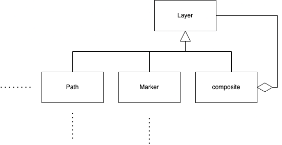

# 

**Über arc42**

arc42, das Template zur Dokumentation von Software- und
Systemarchitekturen.

Erstellt von Dr. Gernot Starke, Dr. Peter Hruschka und Mitwirkenden.

Template Revision: 8.0 DE (asciidoc-based), Februar 2022

© We acknowledge that this document uses material from the arc42
architecture template, <https://arc42.org>.

::: note
Diese Version des Templates enthält Hilfen und Erläuterungen. Sie dient
der Einarbeitung in arc42 sowie dem Verständnis der Konzepte. Für die
Dokumentation eigener System verwenden Sie besser die *plain* Version.
:::

# Einführung und Ziele {#section-introduction-and-goals}

Beschreibt die wesentlichen Anforderungen und treibenden Kräfte, die bei
der Umsetzung der Softwarearchitektur und Entwicklung des Systems
berücksichtigt werden müssen.

Dazu gehören:

-   zugrunde liegende Geschäftsziele,

-   wesentliche Aufgabenstellungen,

-   wesentliche funktionale Anforderungen,

-   Qualitätsziele für die Architektur und

-   relevante Stakeholder und deren Erwartungshaltung.

## Aufgabenstellung {#_aufgabenstellung}

::: formalpara-title
**Inhalt**
:::

Kurzbeschreibung der fachlichen Aufgabenstellung, treibenden Kräfte,
Extrakt (oder Abstract) der Anforderungen. Verweis auf (hoffentlich
vorliegende) Anforderungsdokumente (mit Versionsbezeichnungen und
Ablageorten).

::: formalpara-title
**Motivation**
:::

Aus Sicht der späteren Nutzung ist die Unterstützung einer fachlichen
Aufgabe oder Verbesserung der Qualität der eigentliche Beweggrund, ein
neues System zu schaffen oder ein bestehendes zu modifizieren.

::: formalpara-title
**Form**
:::

Kurze textuelle Beschreibung, eventuell in tabellarischer Use-Case Form.
Sofern vorhanden, sollte die Aufgabenstellung Verweise auf die
entsprechenden Anforderungsdokumente enthalten.

Halten Sie diese Auszüge so knapp wie möglich und wägen Sie Lesbarkeit
und Redundanzfreiheit gegeneinander ab.

Siehe [Anforderungen und Ziele](https://docs.arc42.org/section-1/) in
der online-Dokumentation (auf Englisch!).

## Qualitätsziele {#_qualit_tsziele}

::: formalpara-title
**Inhalt**
:::

Die Top-3 bis Top-5 der Qualitätsanforderungen für die Architektur,
deren Erfüllung oder Einhaltung den maßgeblichen Stakeholdern besonders
wichtig sind. Gemeint sind hier wirklich Qualitätsziele, die nicht
unbedingt mit den Zielen des Projekts übereinstimmen. Beachten Sie den
Unterschied.

Hier ein Überblick möglicher Themen (basierend auf dem ISO 25010
Standard):

::: formalpara-title
**Motivation**
:::

Weil Qualitätsziele grundlegende Architekturentscheidungen oft
maßgeblich beeinflussen, sollten Sie die für Ihre Stakeholder relevanten
Qualitätsziele kennen, möglichst konkret und operationalisierbar.

::: formalpara-title
**Form**
:::

Tabellarische Darstellung der Qualitätsziele mit möglichst konkreten
Szenarien, geordnet nach Prioritäten.

## Stakeholder {#_stakeholder}

::: formalpara-title
**Inhalt**
:::

Expliziter Überblick über die Stakeholder des Systems -- über alle
Personen, Rollen oder Organisationen --, die

-   die Architektur kennen sollten oder

-   von der Architektur überzeugt werden müssen,

-   mit der Architektur oder dem Code arbeiten (z.B. Schnittstellen
    nutzen),

-   die Dokumentation der Architektur für ihre eigene Arbeit benötigen,

-   Entscheidungen über das System und dessen Entwicklung treffen.

::: formalpara-title
**Motivation**
:::

Sie sollten die Projektbeteiligten und -betroffenen kennen, sonst
erleben Sie später im Entwicklungsprozess Überraschungen. Diese
Stakeholder bestimmen unter anderem Umfang und Detaillierungsgrad der
von Ihnen zu leistenden Arbeit und Ergebnisse.

::: formalpara-title
**Form**
:::

Tabelle mit Rollen- oder Personennamen, sowie deren Erwartungshaltung
bezüglich der Architektur und deren Dokumentation.

+-----------------+-----------------+-----------------------------------+
| Rolle           | Kontakt         | Erwartungshaltung                 |
+=================+=================+===================================+
| *\<Rolle-1>*    | *\<Kontakt-1>*  | *\<Erwartung-1>*                  |
+-----------------+-----------------+-----------------------------------+
| *\<Rolle-2>*    | *\<Kontakt-2>*  | *\<Erwartung-2>*                  |
+-----------------+-----------------+-----------------------------------+

# Randbedingungen {#section-architecture-constraints}

::: formalpara-title
**Inhalt**
:::

Randbedingungen und Vorgaben, die ihre Freiheiten bezüglich Entwurf,
Implementierung oder Ihres Entwicklungsprozesses einschränken. Diese
Randbedingungen gelten manchmal organisations- oder firmenweit über die
Grenzen einzelner Systeme hinweg.

::: formalpara-title
**Motivation**
:::

Für eine tragfähige Architektur sollten Sie genau wissen, wo Ihre
Freiheitsgrade bezüglich der Entwurfsentscheidungen liegen und wo Sie
Randbedingungen beachten müssen. Sie können Randbedingungen vielleicht
noch verhandeln, zunächst sind sie aber da.

::: formalpara-title
**Form**
:::

Einfache Tabellen der Randbedingungen mit Erläuterungen. Bei Bedarf
unterscheiden Sie technische, organisatorische und politische
Randbedingungen oder übergreifende Konventionen (beispielsweise
Programmier- oder Versionierungsrichtlinien, Dokumentations- oder
Namenskonvention).

Siehe [Randbedingungen](https://docs.arc42.org/section-2/) in der
online-Dokumentation (auf Englisch!).

# Kontextabgrenzung {#section-system-scope-and-context}

::: formalpara-title
**Inhalt**
:::

Die Kontextabgrenzung grenzt das System von allen
Kommunikationsbeziehungen (Nachbarsystemen und Benutzerrollen) ab. Sie
legt damit die externen Schnittstellen fest.

Differenzieren Sie fachliche (fachliche Ein- und Ausgaben) und
technische Kontexte (Kanäle, Protokolle, Hardware), falls nötig.

::: formalpara-title
**Motivation**
:::

Die fachlichen und technischen Schnittstellen zur Kommunikation gehören
zu den kritischsten Aspekten eines Systems. Stellen Sie sicher, dass Sie
diese komplett verstanden haben.

::: formalpara-title
**Form**
:::

Verschiedene Optionen:

-   Diverse Kontextdiagramme

-   Listen von Kommunikationsbeziehungen mit deren Schnittstellen

Siehe [Kontextabgrenzung](https://docs.arc42.org/section-3/) in der
online-Dokumentation (auf Englisch!).

## Fachlicher Kontext {#_fachlicher_kontext}

::: formalpara-title
**Inhalt**
:::

Festlegung **aller** Kommunikationsbeziehungen (Nutzer, IT-Systeme, ...)
mit Erklärung der fachlichen Ein- und Ausgabedaten oder Schnittstellen.
Zusätzlich (bei Bedarf) fachliche Datenformate oder Protokolle der
Kommunikation mit den Nachbarsystemen.

::: formalpara-title
**Motivation**
:::

Alle Beteiligten müssen verstehen, welche fachlichen Informationen mit
der Umwelt ausgetauscht werden.

::: formalpara-title
**Form**
:::

Alle Diagrammarten, die das System als Blackbox darstellen und die
fachlichen Schnittstellen zu den Nachbarsystemen beschreiben.

Alternativ oder ergänzend können Sie eine Tabelle verwenden. Der Titel
gibt den Namen Ihres Systems wieder; die drei Spalten sind:
Kommunikationsbeziehung, Eingabe, Ausgabe.

**\<Diagramm und/oder Tabelle>**

**\<optional: Erläuterung der externen fachlichen Schnittstellen>**

## Technischer Kontext {#_technischer_kontext}

::: formalpara-title
**Inhalt**
:::

Technische Schnittstellen (Kanäle, Übertragungsmedien) zwischen dem
System und seiner Umwelt. Zusätzlich eine Erklärung (*mapping*), welche
fachlichen Ein- und Ausgaben über welche technischen Kanäle fließen.

::: formalpara-title
**Motivation**
:::

Viele Stakeholder treffen Architekturentscheidungen auf Basis der
technischen Schnittstellen des Systems zu seinem Kontext.

Insbesondere bei der Entwicklung von Infrastruktur oder Hardware sind
diese technischen Schnittstellen durchaus entscheidend.

::: formalpara-title
**Form**
:::

Beispielsweise UML Deployment-Diagramme mit den Kanälen zu
Nachbarsystemen, begleitet von einer Tabelle, die Kanäle auf
Ein-/Ausgaben abbildet.

**\<Diagramm oder Tabelle>**

**\<optional: Erläuterung der externen technischen Schnittstellen>**

**\<Mapping fachliche auf technische Schnittstellen>**

# Lösungsstrategie {#section-solution-strategy}

::: formalpara-title
**Inhalt**
:::

Kurzer Überblick über die grundlegenden Entscheidungen und
Lösungsansätze, die Entwurf und Implementierung des Systems prägen.
Hierzu gehören:

-   Technologieentscheidungen

-   Entscheidungen über die Top-Level-Zerlegung des Systems,
    beispielsweise die Verwendung gesamthaft prägender Entwurfs- oder
    Architekturmuster,

-   Entscheidungen zur Erreichung der wichtigsten Qualitätsanforderungen
    sowie

-   relevante organisatorische Entscheidungen, beispielsweise für
    bestimmte Entwicklungsprozesse oder Delegation bestimmter Aufgaben
    an andere Stakeholder.

::: formalpara-title
**Motivation**
:::

Diese wichtigen Entscheidungen bilden wesentliche „Eckpfeiler" der
Architektur. Von ihnen hängen viele weitere Entscheidungen oder
Implementierungsregeln ab.

::: formalpara-title
**Form**
:::

Fassen Sie die zentralen Entwurfsentscheidungen **kurz** zusammen.
Motivieren Sie, ausgehend von Aufgabenstellung, Qualitätszielen und
Randbedingungen, was Sie entschieden haben und warum Sie so entschieden
haben. Vermeiden Sie redundante Beschreibungen und verweisen Sie eher
auf weitere Ausführungen in Folgeabschnitten.

Siehe [Lösungsstrategie](https://docs.arc42.org/section-4/) in der
online-Dokumentation (auf Englisch!).

# Bausteinsicht {#section-building-block-view}

::: formalpara-title
**Inhalt**
:::

Diese Sicht zeigt die statische Zerlegung des Systems in Bausteine sowie
deren Beziehungen. Beispiele für Bausteine sind unter anderem:

-   Module

-   Komponenten

-   Subsysteme

-   Klassen

-   Interfaces

-   Pakete

-   Bibliotheken

-   Frameworks

-   Schichten

-   Partitionen

-   Tiers

-   Funktionen

-   Makros

-   Operationen

-   Datenstrukturen

-   ...

Diese Sicht sollte in jeder Architekturdokumentation vorhanden sein. In
der Analogie zum Hausbau bildet die Bausteinsicht den *Grundrissplan*.

::: formalpara-title
**Motivation**
:::

Behalten Sie den Überblick über den Quellcode, indem Sie die statische
Struktur des Systems durch Abstraktion verständlich machen.

Damit ermöglichen Sie Kommunikation auf abstrakterer Ebene, ohne zu
viele Implementierungsdetails offenlegen zu müssen.

::: formalpara-title
**Form**
:::

Die Bausteinsicht ist eine hierarchische Sammlung von Blackboxen und
Whiteboxen (siehe Abbildung unten) und deren Beschreibungen.

**Ebene 1** ist die Whitebox-Beschreibung des Gesamtsystems, zusammen
mit Blackbox-Beschreibungen der darin enthaltenen Bausteine.

**Ebene 2** zoomt in einige Bausteine der Ebene 1 hinein. Sie enthält
somit die Whitebox-Beschreibungen ausgewählter Bausteine der Ebene 1,
jeweils zusammen mit Blackbox-Beschreibungen darin enthaltener
Bausteine.

**Ebene 3** zoomt in einige Bausteine der Ebene 2 hinein, usw.

Siehe [Bausteinsicht](https://docs.arc42.org/section-5/) in der
online-Dokumentation (auf Englisch!).

## Whitebox Gesamtsystem {#_whitebox_gesamtsystem}

An dieser Stelle beschreiben Sie die Zerlegung des Gesamtsystems anhand
des nachfolgenden Whitebox-Templates. Dieses enthält:

-   Ein Übersichtsdiagramm

-   die Begründung dieser Zerlegung

-   Blackbox-Beschreibungen der hier enthaltenen Bausteine. Dafür haben
    Sie verschiedene Optionen:

    -   in *einer* Tabelle, gibt einen kurzen und pragmatischen
        Überblick über die enthaltenen Bausteine sowie deren
        Schnittstellen.

    -   als Liste von Blackbox-Beschreibungen der Bausteine, gemäß dem
        Blackbox-Template (siehe unten). Diese Liste können Sie, je nach
        Werkzeug, etwa in Form von Unterkapiteln (Text), Unter-Seiten
        (Wiki) oder geschachtelten Elementen (Modellierungswerkzeug)
        darstellen.

-   (optional:) wichtige Schnittstellen, die nicht bereits im
    Blackbox-Template eines der Bausteine erläutert werden, aber für das
    Verständnis der Whitebox von zentraler Bedeutung sind. Aufgrund der
    vielfältigen Möglichkeiten oder Ausprägungen von Schnittstellen
    geben wir hierzu kein weiteres Template vor. Im schlimmsten Fall
    müssen Sie Syntax, Semantik, Protokolle, Fehlerverhalten,
    Restriktionen, Versionen, Qualitätseigenschaften, notwendige
    Kompatibilitäten und vieles mehr spezifizieren oder beschreiben. Im
    besten Fall kommen Sie mit Beispielen oder einfachen Signaturen
    zurecht.

***\<Übersichtsdiagramm>***

Begründung

:   *\<Erläuternder Text>*

Enthaltene Bausteine

:   *\<Beschreibung der enthaltenen Bausteine (Blackboxen)>*

Wichtige Schnittstellen

:   *\<Beschreibung wichtiger Schnittstellen>*

Hier folgen jetzt Erläuterungen zu Blackboxen der Ebene 1.

Falls Sie die tabellarische Beschreibung wählen, so werden Blackboxen
darin nur mit Name und Verantwortung nach folgendem Muster beschrieben:

+-----------------------+-----------------------------------------------+
| **Name**              | **Verantwortung**                             |
+=======================+===============================================+
| *\<Blackbox 1>*       |  *\<Text>*                                    |
+-----------------------+-----------------------------------------------+
| *\<Blackbox 2>*       |  *\<Text>*                                    |
+-----------------------+-----------------------------------------------+

Falls Sie die ausführliche Liste von Blackbox-Beschreibungen wählen,
beschreiben Sie jede wichtige Blackbox in einem eigenen
Blackbox-Template. Dessen Überschrift ist jeweils der Namen dieser
Blackbox.

### \<Name Blackbox 1> {#__name_blackbox_1}

Beschreiben Sie die \<Blackbox 1> anhand des folgenden
Blackbox-Templates:

-   Zweck/Verantwortung

-   Schnittstelle(n), sofern diese nicht als eigenständige
    Beschreibungen herausgezogen sind. Hierzu gehören eventuell auch
    Qualitäts- und Leistungsmerkmale dieser Schnittstelle.

-   (Optional) Qualitäts-/Leistungsmerkmale der Blackbox, beispielsweise
    Verfügbarkeit, Laufzeitverhalten o. Ä.

-   (Optional) Ablageort/Datei(en)

-   (Optional) Erfüllte Anforderungen, falls Sie Traceability zu
    Anforderungen benötigen.

-   (Optional) Offene Punkte/Probleme/Risiken

*\<Zweck/Verantwortung>*

*\<Schnittstelle(n)>*

*\<(Optional) Qualitäts-/Leistungsmerkmale>*

*\<(Optional) Ablageort/Datei(en)>*

*\<(Optional) Erfüllte Anforderungen>*

*\<(optional) Offene Punkte/Probleme/Risiken>*

### \<Name Blackbox 2> {#__name_blackbox_2}

*\<Blackbox-Template>*

### \<Name Blackbox n> {#__name_blackbox_n}

*\<Blackbox-Template>*

### \<Name Schnittstelle 1> {#__name_schnittstelle_1}

...

### \<Name Schnittstelle m> {#__name_schnittstelle_m}

## Ebene 2 {#_ebene_2}

Beschreiben Sie den inneren Aufbau (einiger) Bausteine aus Ebene 1 als
Whitebox.

Welche Bausteine Ihres Systems Sie hier beschreiben, müssen Sie selbst
entscheiden. Bitte stellen Sie dabei Relevanz vor Vollständigkeit.
Skizzieren Sie wichtige, überraschende, riskante, komplexe oder
besonders volatile Bausteine. Normale, einfache oder standardisierte
Teile sollten Sie weglassen.

### Whitebox *\<Baustein 1>* {#_whitebox_emphasis_baustein_1_emphasis}

...zeigt das Innenleben von *Baustein 1*.

*\<Whitebox-Template>*

### Whitebox *\<Baustein 2>* {#_whitebox_emphasis_baustein_2_emphasis}

*\<Whitebox-Template>*

...

### Whitebox *\<Baustein m>* {#_whitebox_emphasis_baustein_m_emphasis}

*\<Whitebox-Template>*

## Ebene 3 {#_ebene_3}

Beschreiben Sie den inneren Aufbau (einiger) Bausteine aus Ebene 2 als
Whitebox.

Bei tieferen Gliederungen der Architektur kopieren Sie diesen Teil von
arc42 für die weiteren Ebenen.

### Whitebox \<\_Baustein x.1\_\> {#_whitebox_baustein_x_1}

...zeigt das Innenleben von *Baustein x.1*.

*\<Whitebox-Template>*

### Whitebox \<\_Baustein x.2\_\> {#_whitebox_baustein_x_2}

*\<Whitebox-Template>*

### Whitebox \<\_Baustein y.1\_\> {#_whitebox_baustein_y_1}

*\<Whitebox-Template>*

# Laufzeitsicht {#section-runtime-view}

::: formalpara-title
**Inhalt**
:::

Diese Sicht erklärt konkrete Abläufe und Beziehungen zwischen Bausteinen
in Form von Szenarien aus den folgenden Bereichen:

-   Wichtige Abläufe oder *Features*: Wie führen die Bausteine der
    Architektur die wichtigsten Abläufe durch?

-   Interaktionen an kritischen externen Schnittstellen: Wie arbeiten
    Bausteine mit Nutzern und Nachbarsystemen zusammen?

-   Betrieb und Administration: Inbetriebnahme, Start, Stop.

-   Fehler- und Ausnahmeszenarien

Anmerkung: Das Kriterium für die Auswahl der möglichen Szenarien (d.h.
Abläufe) des Systems ist deren Architekturrelevanz. Es geht nicht darum,
möglichst viele Abläufe darzustellen, sondern eine angemessene Auswahl
zu dokumentieren.

::: formalpara-title
**Motivation**
:::

Sie sollten verstehen, wie (Instanzen von) Bausteine(n) Ihres Systems
ihre jeweiligen Aufgaben erfüllen und zur Laufzeit miteinander
kommunizieren.

Nutzen Sie diese Szenarien in der Dokumentation hauptsächlich für eine
verständlichere Kommunikation mit denjenigen Stakeholdern, die die
statischen Modelle (z.B. Bausteinsicht, Verteilungssicht) weniger
verständlich finden.

::: formalpara-title
**Form**
:::

Für die Beschreibung von Szenarien gibt es zahlreiche
Ausdrucksmöglichkeiten. Nutzen Sie beispielsweise:

-   Nummerierte Schrittfolgen oder Aufzählungen in Umgangssprache

-   Aktivitäts- oder Flussdiagramme

-   Sequenzdiagramme

-   BPMN (Geschäftsprozessmodell und -notation) oder EPKs
    (Ereignis-Prozessketten)

-   Zustandsautomaten

-   ...

Siehe [Laufzeitsicht](https://docs.arc42.org/section-6/) in der
online-Dokumentation (auf Englisch!).

## *\<Bezeichnung Laufzeitszenario 1>* {#__emphasis_bezeichnung_laufzeitszenario_1_emphasis}

-   \<hier Laufzeitdiagramm oder Ablaufbeschreibung einfügen>

-   \<hier Besonderheiten bei dem Zusammenspiel der Bausteine in diesem
    Szenario erläutern>

## *\<Bezeichnung Laufzeitszenario 2>* {#__emphasis_bezeichnung_laufzeitszenario_2_emphasis}

...

## *\<Bezeichnung Laufzeitszenario n>* {#__emphasis_bezeichnung_laufzeitszenario_n_emphasis}

...

# Verteilungssicht {#section-deployment-view}

::: formalpara-title
**Inhalt**
:::

Die Verteilungssicht beschreibt:

1.  die technische Infrastruktur, auf der Ihr System ausgeführt wird,
    mit Infrastrukturelementen wie Standorten, Umgebungen, Rechnern,
    Prozessoren, Kanälen und Netztopologien sowie sonstigen
    Bestandteilen, und

2.  die Abbildung von (Software-)Bausteinen auf diese Infrastruktur.

Häufig laufen Systeme in unterschiedlichen Umgebungen, beispielsweise
Entwicklung-/Test- oder Produktionsumgebungen. In solchen Fällen sollten
Sie alle relevanten Umgebungen aufzeigen.

Nutzen Sie die Verteilungssicht insbesondere dann, wenn Ihre Software
auf mehr als einem Rechner, Prozessor, Server oder Container abläuft
oder Sie Ihre Hardware sogar selbst konstruieren.

Aus Softwaresicht genügt es, auf die Aspekte zu achten, die für die
Softwareverteilung relevant sind. Insbesondere bei der
Hardwareentwicklung kann es notwendig sein, die Infrastruktur mit
beliebigen Details zu beschreiben.

::: formalpara-title
**Motivation**
:::

Software läuft nicht ohne Infrastruktur. Diese zugrundeliegende
Infrastruktur beeinflusst Ihr System und/oder querschnittliche
Lösungskonzepte, daher müssen Sie diese Infrastruktur kennen.

::: formalpara-title
**Form**
:::

Das oberste Verteilungsdiagramm könnte bereits in Ihrem technischen
Kontext enthalten sein, mit Ihrer Infrastruktur als EINE Blackbox. Jetzt
zoomen Sie in diese Infrastruktur mit weiteren Verteilungsdiagrammen
hinein:

-   Die UML stellt mit Verteilungsdiagrammen (Deployment diagrams) eine
    Diagrammart zur Verfügung, um diese Sicht auszudrücken. Nutzen Sie
    diese, evtl. auch geschachtelt, wenn Ihre Verteilungsstruktur es
    verlangt.

-   Falls Ihre Infrastruktur-Stakeholder andere Diagrammarten
    bevorzugen, die beispielsweise Prozessoren und Kanäle zeigen, sind
    diese hier ebenfalls einsetzbar.

Siehe [Verteilungssicht](https://docs.arc42.org/section-7/) in der
online-Dokumentation (auf Englisch!).

## Infrastruktur Ebene 1 {#_infrastruktur_ebene_1}

An dieser Stelle beschreiben Sie (als Kombination von Diagrammen mit
Tabellen oder Texten):

-   die Verteilung des Gesamtsystems auf mehrere Standorte, Umgebungen,
    Rechner, Prozessoren o. Ä., sowie die physischen Verbindungskanäle
    zwischen diesen,

-   wichtige Begründungen für diese Verteilungsstruktur,

-   Qualitäts- und/oder Leistungsmerkmale dieser Infrastruktur,

-   Zuordnung von Softwareartefakten zu Bestandteilen der Infrastruktur

Für mehrere Umgebungen oder alternative Deployments kopieren Sie diesen
Teil von arc42 für alle wichtigen Umgebungen/Varianten.

***\<Übersichtsdiagramm>***

Begründung

:   *\<Erläuternder Text>*

Qualitäts- und/oder Leistungsmerkmale

:   *\<Erläuternder Text>*

Zuordnung von Bausteinen zu Infrastruktur

:   *\<Beschreibung der Zuordnung>*

## Infrastruktur Ebene 2 {#_infrastruktur_ebene_2}

An dieser Stelle können Sie den inneren Aufbau (einiger)
Infrastrukturelemente aus Ebene 1 beschreiben.

Für jedes Infrastrukturelement kopieren Sie die Struktur aus Ebene 1.

### *\<Infrastrukturelement 1>* {#__emphasis_infrastrukturelement_1_emphasis}

*\<Diagramm + Erläuterungen>*

### *\<Infrastrukturelement 2>* {#__emphasis_infrastrukturelement_2_emphasis}

*\<Diagramm + Erläuterungen>*

...

### *\<Infrastrukturelement n>* {#__emphasis_infrastrukturelement_n_emphasis}

*\<Diagramm + Erläuterungen>*

<!--- ab hier Toms Part -->
# Querschnittliche Konzepte
**Inhalt**

Dieser Abschnitt beschreibt übergreifende, prinzipielle Regelungen und
Lösungsansätze, die an mehreren Stellen (=*querschnittlich*) relevant
sind.

Solche Konzepte betreffen oft mehrere Bausteine. Dazu können vielerlei
Themen gehören, beispielsweise:

-   Modelle, insbesondere fachliche Modelle

-   Architektur- oder Entwurfsmuster

-   Regeln für den konkreten Einsatz von Technologien

-   prinzipielle --- meist technische --- Festlegungen übergreifender
    Art

-   Implementierungsregeln

::: formalpara-title
**Motivation**
:::

Konzepte bilden die Grundlage für *konzeptionelle Integrität*
(Konsistenz, Homogenität) der Architektur und damit eine wesentliche
Grundlage für die innere Qualität Ihrer Systeme.

Manche dieser Themen lassen sich nur schwer als Baustein in der
Architektur unterbringen (z.B. das Thema „Sicherheit").

::: formalpara-title
**Form**
:::

Kann vielfältig sein:

-   Konzeptpapiere mit beliebiger Gliederung,

-   übergreifende Modelle/Szenarien mit Notationen, die Sie auch in den
    Architektursichten nutzen,

-   beispielhafte Implementierung speziell für technische Konzepte,

-   Verweise auf „übliche" Nutzung von Standard-Frameworks
    (beispielsweise die Nutzung von Hibernate als Object/Relational
    Mapper).

::: formalpara-title
**Struktur**
:::

Eine mögliche (nicht aber notwendige!) Untergliederung dieses
Abschnittes könnte wie folgt aussehen (wobei die Zuordnung von Themen zu
den Gruppen nicht immer eindeutig ist):

-   Fachliche Konzepte

-   User Experience (UX)

-   Sicherheitskonzepte (Safety und Security)

-   Architektur- und Entwurfsmuster

-   Unter-der-Haube

-   Entwicklungskonzepte

-   Betriebskonzepte

Siehe [Querschnittliche Konzepte](https://docs.arc42.org/section-8/) in
der online-Dokumentation (auf Englisch).

## *Fachliche Konzepte*

Es werden keine Domänenbausteine benötigt, da Leaflet eine Open-Source-UI-Bibliothek für Karten ist, für die sich der Endbenutzer oder Entwickler nicht registrieren muss.

## *Architektur-und Entwurfsmuster* 

Im Blick auf das von Leaflet bereitgestellte Architekturdiagramm ..

Siehe [Leaflet Struktur](https://leafletjs.com/examples/extending/class-diagram.html) in
der Dokumentation von Leaflet (auf Englisch).

wir finden folgendes:
-   Das Leaflet-Team entscheidet sich für die einfache Vererbung (erweitern und einschließen) für fast alle Relationen der Projektklassen in einer zusammenhängenden Angelegenheit (z. B. "hat eine" oder "enthält" Relationen).
-   Da die Entwickler das Composite-Konzept noch nicht ausgeschöpft haben, schlagen wir vor, mehrere Composites in der Architektur für mehr Modularität hinzuzufügen.
-   Zum Beispiel erben die Module Marker (L.Marker), Path (L.Path), Layer Group (L.LayerGroup) und andere von der Muttermodul-Layer (L.Layer). Da eine Ebene eine andere Ebene erben kann, die eine Ebenengruppe bildet (das Stapeln mehrerer Ebenen ist möglich), können wir stattdessen eine zusammengesetzte Vorlage (composite template) verwenden:

Hier kann eine Ebene Pfad, Marker oder ein "Composite" sein.

-   Die Projektmodularität ist ebenfalls logisch und leicht zu erkennen, wobei jede Klasse ein Modul darstellt, insbesondere für Schlüsselbausteine wie Controller, Handler, Layer, Zoom oder die geometrischen Module.

## *User Experience (UX)* 

Leaflet setzt auf gängige Benutzeroberflächen für eine für den Benutzer erlernbare und vereinfachte Karte.

## *Sicherheitskonzepte* 

Da alle Leaflet-Services öffentlich zugänglich sind, muss kein Schutz gegen Datenschutzangriffe eingerichtet werden. Der Code kann jedoch nur geändert werden, nachdem er von vertrauenswürdigen Betreuern überprüft wurde.

## *Entwicklungskonzepte* 

-   **Erstellen, Testen, Bereitstellen:** Leaflet verwendet CI/CD-Konzepte, um sicherzustellen, dass alle Funktionen vor jeder Veröffentlichung testbar und funktionsfähig sind.
-   **Konfigurierbarkeit:** Das Projekt und die Karten sind anpassbar und können immer an die Bedürfnisse des Benutzers angepasst werden.
-   **Migration:** Das Projekt hat ein hohes Maß an Flexibilität, da es auf vielen Plattformen ausgeführt werden kann, was die Migration des Codes von einer Umgebung in eine andere ermöglicht.

## *Unter-der-Haube* 

Der Leaflet-Verbesserungsprozess beginnt mit der Erstellung von Issue-Ticks von den Endnutzern | Entwickler an die Betreuer. Batches werden als neue Version mit einem Bericht erstellt, der die Verbesserungen in diesem Batch erläutert.

## *Betriebskonzepte*

Die Popularität des Projekts verschafft Leaflet eine Armee gut ausgebildeter Betreuer und Benutzer, die Probleme schnell erkennen und darauf reagieren können, und das ist der Grund für die vertrauenswürdige Verfügbarkeit von Leaflet.

<!-- Toms Part -->
# Architekturentscheidungen 

**Inhalt**

Wichtige, teure, große oder riskante Architektur- oder
Entwurfsentscheidungen inklusive der jeweiligen Begründungen. Mit
\"Entscheidungen\" meinen wir hier die Auswahl einer von mehreren
Alternativen unter vorgegebenen Kriterien.

Wägen Sie ab, inwiefern Sie Entscheidungen hier zentral beschreiben,
oder wo eine lokale Beschreibung (z.B. in der Whitebox-Sicht von
Bausteinen) sinnvoller ist. Vermeiden Sie Redundanz. Verweisen Sie evtl.
auf Abschnitt 4, wo schon grundlegende strategische Entscheidungen
beschrieben wurden.

::: formalpara-title
**Motivation**
:::

Stakeholder des Systems sollten wichtige Entscheidungen verstehen und
nachvollziehen können.

::: formalpara-title
**Form**
:::

Verschiedene Möglichkeiten:

-   ADR ([Architecture Decision
    Record](https://thinkrelevance.com/blog/2011/11/15/documenting-architecture-decisions))
    für jede wichtige Entscheidung

-   Liste oder Tabelle, nach Wichtigkeit und Tragweite der
    Entscheidungen geordnet

-   ausführlicher in Form einzelner Unterkapitel je Entscheidung

Siehe [Architekturentscheidungen](https://docs.arc42.org/section-9/) in
der arc42 Dokumentation (auf Englisch!). Dort finden Sie Links und
Beispiele zum Thema ADR.

# Qualitätsanforderungen

### Inhalt

Im folgenden werden die Qualitätsanforderungen an Leaflet konkretisiert. Hierfür dient ein Qualitätsbaum als Grundlage
um dann im weiteren die einzelnen herausgearbeiteten Aspekte näher zu definieren. 

## Qualitätsbaum 

### Inhalt

Der Qualitätsbaum für Leaflet besteht aus 2 Schichten. Hierbei sind ausgehend von der Wurzel 5 verschiedene 
Qualitätsaspekte definiert. Einige dieser Qualitätsaspekte definieren weitere, speziellere Qualitätskriterien welche 
nochmals genauer definiert sind. Alle Kriterien bekommen eine Tabelle mit Qualitätsszenarios. Hierdurch soll sichergestellt
werden, dass die Qualitätsaspekte nachprüfbar und an reale Kriterien gebunden sind. Da Leaflet eine Bilbiothek für 
Entwickler ist, kann es vorkommen, dass sich Qualitätsszenarien in verschiedenen Kategorien doppeln da verschiedene 
Sichten ähnliches verlangen aber eine leicht andere Formulierung haben.

#### Disclaimer
Sämtliche hier genau spezifizierte Requirements finden sich nicht in der originalen Dokumentation von Leaflet und sind 
komplett eigens erstellt worden

### Performance 

Der Qualitätsaspekt **Performance** soll sicherstellen, dass Leaflet angenehm zu benutzen ist. Eine Softwarebibliothek die
Prozesse unnötig verlangsamt ist ineffizient und wird nicht genutzt da sich meist schnell bessere alternativen bieten.
Damit unsere Arbeit hier nicht umsonst ist soll sichergestellt werden, dass Leaflet eine hohe Performance aufweist. 
Dies wird durch zwei näher definierte Kriterien erreicht

##### light-weight

Leaflet sollte in seiner Größe so klein wie möglich sein. Hiermit ist gemeint, dass die komplette Standard-Bibliothek 
möglichst klein sein soll. Leaflet kann erweitert werden, dies soll jedoch den Core nicht interessieren. 

| ID | Szenario |
|-----------------|--------------------|
| P1 | Die komplette Core-Bibliothek soll nicht mehr als 50kb umfassen |
| P2 | In der Core-Bibliothek sind nur notwendige Funktionen implementiert (Notwendigkeit definiert in Bausteinsicht) |
| P3 | Die Core-Bibliothek soll keine Abhängigkeiten von anderer Software haben (keine imports von außerhalb) |

##### feature Completeness

Leaflet soll alle notwendigen Funktionen enthalten die für eine Karten-Bibliothek notwendig sind. Weitere Features sind 
über Plugins zu lösen. Die Szenarien hier können sich überdecken mit Szenarien aus dem Usability-Teil

| ID | Szenario |
|-----------------|--------------------|
| P4 | Ein Nutzer kann in eine Karte hinein/hinaus-zoomen |
| P5 | Ein Nutzer kann eine Karte bewegen (mittels Maus & Touch) |
| P6 | Ein Nutzer kann die Starteinstellung schnell wiederherstellen |

### Documentation

Der Zugang zu Leaflet soll für neue Entwickler, Mitarbeiter oder Nutzer einfach und zugänglich sein. Hierfür
muss gewährleistet werden, dass Leaflet eine saubere und fehlerfreie Dokumentation bietet die umfassend über sämtliche
Strukturen, insbesondere der Architektur, informiert.

| ID | Szenario |
|-----------------|--------------------|
| D1 | Jemand möchte Leaflet schnell überblicken können, hierfür findet er ein Klassendiagramm vor |
| D2 | Ein neuer Entwickler möchte Leaflet schnell nutzen können, hierzu findet er eine Dokumentation mit allen verfügbaren Funktionen vor und einer kurzen Beschreibung |
| D3 | Ein Entwickler findet schnell umfangreiche Beispielprojekte mit Leaflet an denen er die Anwendung erlernen kann |

### Usability

Damit Leaflet seinen Zweck erfüllt müssen die wichtigsten, grundlegenden Funktionen, die eine Kartensoftware haben 
muss implementiert sein. Welche Funktionen als wichtig und grundlegen zählen wurden vorher schon festgelegt (hinweis wo festgelegt einfügen)
Hier sollen jetzt genauere Szenarien folgen welche die Usability überprüfbar machen.

| ID | Szenario |
|-----------------|--------------------|
| U1 | Ein Nutzer kann in eine Karte hinein/hinaus-zoomen und von Leaflet gesetzte Elemente behalten ihre relative Position |
| U2 | Ein Nutzer kann Elemente auf der Karte bewegen wenn dies vom Entwickler gewollt ist |
| U3 | Ein Nutzer kann mit Leaflet auf verschiedene Arten agieren (Touch/Maus)  |
| U4 | Ein Entwickler kann Layer auf der Map verteilen und in diesen Elemente zuordnen |
| U5 | In Leaflet sind diverse geometrische Elemente vordefiniert und einfach zu nutzen (Rechtecke, Dreiecke, Kreise etc.) |
| U6 | Die Funktionsweise von Leaflet unterscheidet sich nicht zwischen verschiedenen Kartenanbietern |

#### Responsive
Da Leaflet eine Javascript Bibliothek ist, kann davon ausgegangen werden, dass sie sowohl auf mobilen als auch 
Desktop Geräten benutzt wird. Damit die User Experience durchgängig konstant gut ist, muss Leaflet responsiv 
sein und sich an diverse Oberflächen anpassen.

| ID | Szenario |
|-----------------|--------------------|
| U7 | Leaflet muss CSS unterstützen sodass Templates mit Regeln für diverse Layouts funktionieren (Responsives Problem wird an CSS ausgelagert)|

#### Dependability
Wie in **Responsive** schon erläutert ist Leaflet auf diversen Geräten/Oberflächen genutzt. Da verschiedene Geräte
nicht nur unterschiedliche optische Darstellungen haben sondern auch andere technische Gegegebenheiten muss genau darauf
geachtet werden, dass Leaflet unabhängig vom System lauffähig ist. Hier sei insbesondere darauf geachtet, dass Unterschiede
zwischen verschiedenen Browsern beachtet werden und alles Browser nutzbar sind.

| ID | Szenario |
|-----------------|--------------------|
| U8 | Ein Nutzer kann unabhängig vom Browser Leaflet nutzen  |
| U9 | Als zwingend funktionsfähige Browser sind Firefox, Chrome, Opera, Safari und Edge deklariert |
| U10 | Die Funktionsweise von Leaflet muss in allen Browsern gleich sein (HTML-Elemente müssen immer von Browsern aus U8 unterstüzt sein)  |

#### Compatibility
Leaflet gibt nur Basisfunktionen für die Behandlung von Karten. Es lassen sich jedoch wesentlich weiter gefächerte Aufgaben
an Kartenbibliotheken definieren. Diese sollen aber kein Bestand in dem Kern von Leaflet haben da wir hierdurch das 
Projekt unnötig aufblähen würden und wir so unseren großen Vorteil, die Geschwindigkeit und Kompaktheit, verlieren würden.
Hierzu soll Leaflet eine Unterstützung für Plugins / Mods bieten. Hier sind überprüfbare Szenarien gelistet die 
sicherstellen, dass Leaflet einen sinnvollen und praktischen Ansatz für Plugin-Entwicklung und Deployment liefert. 

| ID | Szenario |
|-----------------|--------------------|
| U11 | Ein Entwickler ist mit dem funktionsumfang von Leaflet noch nicht zufrieden, er findet schnell eine Liste von verfügbaren Plugins mit einer Anleitung wie diese zu installieren sind|
| U12 | Ein Entwickler findet in der Liste kein Plugin für seine Anforderungen, er findet jedoch eine gute Anleitung wie ein Plugin einfach und Konform mittels Template zu erstellen ist |
| U13 | Wenn ein Entwickler ein eigenes Plugin entwickelt hat, so findet er eine Anleitung wie er dieses allgemein verfügbar machen kann |
| U14 | Ein Entwickler fragt sich, wieso sein angefragtes Feature nicht in der Bibliothek ist -> er findet einer Erklärung warum nur die ausgewählten Funktionen verfügbar sind |

### Modifiabilty
Leaflet ist in anderen Projekten eingebettet, da dies hauptsächlich Webprojekte sind, haben diese
einen eigenen Styleguide. Leaflet soll sich diesem so anpassen, dass der Komplette Stil aller
Elemente veränderbar ist.

| ID | Szenario |
|-----------------|--------------------|
| U15 | (ähnlich U7) Leaflet unterstüzt CSS |
| U16 | Leaflet liefert standardmäßige Themes mit für einen schnellen Einstieg in das Design |
| U17 | Elemente von Leaflet lassen sich eigene Klassennamen geben damit diese per CSS veränderbar sind (keine festen Klassennamen in Elementen) |

### Reliability
Da, wie in **Modifiability** schon erwähnt, Leaflet in anderen Projekten eingebettet ist, müssen sich
die Nutzer von Leaflet darauf verlassen können, dass die Funktion und Weiterentwicklung besteht
und außerdem immer erreichbar ist. Es muss sich außerdem darauf verlassen werden können, das
die Software richtig und zuverlässig arbeitet.

| ID | Szenario |
|-----------------|--------------------|
| R1 | Leaflet ist und bleibt ein Open-Source Projekt  |

#### Maintainability
Um die Codebasis von Leaflet stetig weiter zu entwickeln wird das Projekt auf Open-Source Basis
betrieben, sodass jeder die Möglichkeit hat hieran zu arbeiten.

| ID | Szenario |
|-----------------|--------------------|
| R2 | Ein Entwickler entscheidet sich an Leaflet mitzuarbeiten, er findet einen ausführlichen Guideline-Artikel darüber wie man teilnehmen kann und welche Formalitäten zu beachten sind  |
| R3 | Damit Leaflet eine Community an Entwicklern aufbauen kann, ist der komplette Lebenszyklus auf github.com basiert |
| R4 | Ein Entwickler möchte sich einbringen, weiß jedoch nicht wie. Er findet hierfür eine gut sortiere Issue Seite bei github.com  |
| R5 | Jemand entdeckt einen Fehler/Problem, er kann dies einfach bei Issues veröffentlichen |
| R6 | Damit bei kritischen Fragen o.Ä. ein Ansprechpartner vorhanden ist, wird ein Maintainer ausgewählt der als Projektverantwortlicher gilt |

#### Testability
Da Leaflet Open-Source ist und somit jeder Code beisteuern kann, muss sichergestellt werden, dass
genügend Tests verfügbar sind damit das Projekt auf Herz und Nieren getestet werden kann
und jeder seinen geschriebenen Code validieren kann.

| ID | Szenario |
|-----------------|--------------------|
| R7 | Ein Entwickler hat ein neues Plugin entwickelt, dieses bereitet jedoch noch Probleme. Er findet diverse Skripte um Funktionen zu testen und so den Fehler zu lokalisieren |
| R8 | Ein Entwickler möchte sein fertiges Plugin veröffentlichen, er muss hierfür eine Reihe von Test-Skripten erfolgreich absolvieren |
| R9 | Ein Entwickler möchte sein fertiges Plugin veröffentlichen, er muss hierfür auch eine Dokumentation zur Verfügung stellen |

# Risiken und technische Schulden {#section-technical-risks}

::: formalpara-title
**Inhalt**
:::

Eine nach Prioritäten geordnete Liste der erkannten Architekturrisiken
und/oder technischen Schulden.

> Risikomanagement ist Projektmanagement für Erwachsene.
>
> ---  Tim Lister Atlantic Systems Guild

Unter diesem Motto sollten Sie Architekturrisiken und/oder technische
Schulden gezielt ermitteln, bewerten und Ihren Management-Stakeholdern
(z.B. Projektleitung, Product-Owner) transparent machen.

::: formalpara-title
**Form**
:::

Liste oder Tabelle von Risiken und/oder technischen Schulden, eventuell
mit vorgeschlagenen Maßnahmen zur Risikovermeidung, Risikominimierung
oder dem Abbau der technischen Schulden.

Siehe [Risiken und technische
Schulden](https://docs.arc42.org/section-11/) in der
online-Dokumentation (auf Englisch!).

# Glossar

Hier sind wesentliche, wichtige Begriffe aus fachlicher und technischer Sicht 
dokumentiert und erklärt. Hierbei werden vor allem die Sichten aller Stakeholder betrachtet, so dass
diese hier eine einfache Übersicht finden falls Begriffe unklar sind.

| Term | Meaning |
|-----------------|--------------------|
| JavaScript | The Programming Language Leaflet uses |
| Stakeholder | Person or Group involved in the usage of Leaflet |
| CDN | Content Delivery Network - deliver Code or Text fast from a Network of Servers |
| Requirement(s) | Wishes and Needs for the project |
| Vanilla JS | JavaScript out-of-the-box without any dependencies |
| Mod / Plugin | Code that improves Leaflet without belonging to the Core of Leaflet |
| Layer | a theme or overlay of the map |
| popup | an information window that opens in the viewing frame of the map |
| marker | a pin or an image that marks geographical locations on the map |
| Tooltip | a window the same as a popup but for the locations |
| Dependence | Libraries or Plugins from third-party providers |
| End user | A person who interacts with the product with the intention of only using the product for his needs |
| Developer | A person who interacts with the product with the intention of using the product for his needs and contributing to the development of the product |
