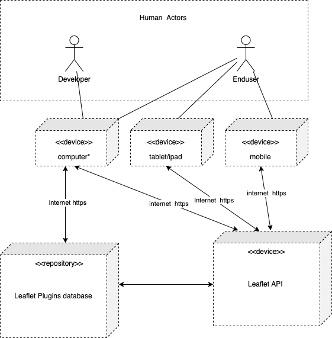

# Leaflet - Architekturdokumentation

Dieses Dokument stellt eine vollständige Architekturdokumentation für Leaflet dar. 
Zur Erstellung dieser Dokumentation wurden sich diverser Reverse-Engineering Technicken angewendet
da diese in der originalen Leaflet-Variante nicht vorhanden ist. 

# Gliederung 

1. [Einführung und Ziele](#einfuhrung)
2. [Randbedingungen](#randbedingungen)
3. [Kontextabgrenzung](#kontextabgrenzung)
4. [Lösungsstrategie](#lösungsstrategie)
5. [Bausteinsicht](#bausteinsicht)
6. [Laufzeitsicht](#laufzeitsicht)
7. [Verteilungssicht](#verteilungssicht)
8. [Querschnittliche Konzepte](#querschnittlichekonzepte)
9. [Architekturentscheidungen](#architekturentscheidungen)
10. [Qualitätsanforderungen](#qualittsanforderungen)
11. [Risiken und technische Schulden](#risiken-und-technische-schulden)
12. [Glossar](#glossar)

# Einführung und Ziele

Leaflet soll Entwicklern dabei helfen umfangreiche Funktionen in Karten zu implementieren und diese
vor allem in verschiedenen Skalierungen immer zuverlässig darzustellen.

## Aufgabenstellung 

Leaflet soll es einem Entwickler einfacher machen, Karten in einer interaktiven Art und Weise, zu implementieren.
Hierfür kann er mit einer Recht einfachen JavaScript-Programmierung Elemente und vieles weitere auf einer Karte erstellen. 
Eine einzelne Karte wie diese:

lässt sich durch einen minimalen Code erzeugen: 

    var map = L.map('map').setView([51.505, -0.09], 13);

    L.tileLayer('https://{s}.tile.openstreetmap.org/{z}/{x}/{y}.png', {
    attribution: '&copy; <a href="https://www.openstreetmap.org/copyright">OpenStreetMap</a> contributors'
    }).addTo(map);

    L.marker([51.5, -0.09]).addTo(map)
    .bindPopup('A pretty CSS3 popup.  Easily customizable.')
    .openPopup();

weitere simple Beispiele lassen sich [hier](https://leafletjs.com/examples.html) finden

Eine exakte Auflistung aller Aufgaben die Leaflet erfüllen soll lässt sich [hier](https://github.com/gernhard1337/Leaflet/blob/SE-GA/submission/phase%201/scoping_document.md#requirements)  finden.

## Qualitätsziele

Da Leaflet eine Unterstüzung für diverse Webprojekte sein soll ergeben sich hierdurch einige besonders wichtige 
Qualitäsziele. Eine Einhaltung dieser ist inhärent wichtig und darf unter keinen Umständen vernachlässigt werden. 
Diese Ziele sind vor allem: Zuverlässigkeit, Leistungseffizienz, Betreibbarkeit und Übertragbarkeit. 
Es ist wichtig hier diese Ziele näher zu erklären, da spätere Entscheidungen in der Architektur und Umsetzung immer 
zugunsten dieser Ziele zu fällen sind. 
Im folgenden wird näher definiert wieso genau diese Punkte von äußerster Wichtigkeit sind: 

#### Zuverlässigkeit

Da Leaflet in anderen Projekten verwendet wird und kein einzelnes Projekt ist, ist es wichtig, dass Leaflet zuverlässig funktioniert
und keine Störungen hervorruft die andere Projekte stören. Denn andere Projekte verlassen sich darauf das deren importierten Abhängigkeiten 
zuverlässig funktionieren. Dieses Vertrauen will und muss Leaflet bestätigen können.

#### Leistungseffizienz

Leaflet wird vorrangig in Webprojekten verwandt. Um unnötigen Netzwerktraffic zu vermeiden, soll Leaflet effizient 
arbeiten, um rücksicht auf andere zu nehmen, die dieses Netzwerk auch nutzen wollen. Außerdem sind heutzutage Seitenladezeiten
wichtiger Bestandteil der User-Experience und der SEO-Optimierung (bevorzugung von schnellen Ladezeiten). Damit Leaflet kein Klotz
ist der Webprojekte verlangsamt soll auf eine äußerst hohe Leistungseffizienz wert gelegt werden.

#### Betreibbarkeit

Webprojekte haben immer kürzere Deployment-Zeiten und müssen auf schnelle Art und Weise entwickelt werden. Damit diese rasante Entwicklung weitergehen
kann, soll Leaflet sicherstellen, dass es leicht zu erlernen ist und die gewünschten Funktionen bietet.
Ein Entwickler wird hierfür dankbar sein, weil er dadurch ohne großen Aufwand eine vielzahl neuer Funktionen in sein Projekt bringen kann.

#### Übertragbarkeit

Da Leaflet in Webprojekten verwendet wird, ist es nicht möglich sich domänenspezifisch festzulegen, ob das Gerät auf welchem 
Leaflet nun verwendet wird ein Handy, ein Computer oder ein Tablet ist. Außerdem lässt sich nicht festlegen welches Betriebssystem 
diese Geräte haben. Um die Zuverlässigkeit von Leaflet zu gewährleisten ist somit auch die Übertragbarkeit ein wichtiger Punkt für die 
Entwicklung von Leaflet.

## Stakeholder

Leaflet ist darauf ausgelegt, die Bedürfnisse und Wünsche von Entwicklern zu befriedigen. Nichts desto trotz definiert 
Leaflet vier Stakeholder. Den Entwickler, den Nutzer, den Contributor und den Maintainer. Da Leaflet eine javascript Bibliothek für das Frontend
ist wird die Funktionalität vor allem von Nutzern für optische bzw. visuelle Zwecke genutzt. 
Nutzer sehen die Effekte von Leaflet vorallem durch einen Webbrowser während Entwickler Leaflet in ihren Projekten nutzen 
damit sie gewünschte Effekte im Browser hervorrufen können.
Contributor sind Entwickler die sich aktiv in die Entwicklung von Leaflet einbringen. Einer dieser Contributor wird als 
Maintainer deklariert, dieser ist verantwortlich für Leaflet als ganzes.

Die einzelnen Stakeholder nochmal aufgelistet:

| Rolle | Kontakt | Erwartungshaltung |
|-----------------------|-----------------------------------------------|-----------------------------------------|
| Endnutzer | Hoffentlich unzählbar viele | Möglichst einfache, sinnvolle und performante Nutzung von Karten |
| Entwickler | indirekt Trackbar über Einbindung der Dateien | Einfache Einbindung von Karten in diversere Webprojekte ohne diverse Abhängigkeiten|
| Contributor | [Github Contributor-Liste](https://github.com/Leaflet/Leaflet/graphs/contributors) | Gute Nutzung des Projekts, sodass sich Weiterentwicklung lohnt |
| Maintainer | [Github Maintainer](https://agafonkin.com) | Reibungsloser Ablauf der Weiterentwicklung und gelegentliches Eingreifen |

# Randbedingungen 

## Technical constraints

### Leaflet muss sein:

•	plattformunabhängig und auf allen wichtigsten Betriebssystemen und Browsern laufen (T1).

•	Einheitliche Oberfläche.

•	Entwicklung mit JavaScript. sollte auch in neueren Java-Versionen laufen, sofern verfügbar.

•	intern und extern eingesetzt werden können (JS-Datei oder von einem CDN geladen)(T6).

•	eine minimale Codebasis haben(T2).

•	Das geschriebene Quellcode auskommentiert werden.

•	Nach jedem Beitrag gut getestet.

•	Handelt es sich um Drittsoftware (z. B. ein grafisches Frontend), sollte diese idealerweise frei verfügbar und kostenlos sein.

## Organizational constraints

### Es muss:

•	Die Beiträge aus den Leaflet issues sein.

•	Nach der team-entscheidung wird ausgewähltes issues bearbeitet.

•	Die Entscheidung von der Anzahl der Entwickler für jeden Beitrag, durch team -Meeting getroffen.  

•	Die Bearbeitungszeit, vom team gesetzt.  

•	für Jeden Beitrag entsprechende Dokumentation – Berichte erstellen.

•	Der Quellcode der Lösung, oder zumindest Teile davon, werden als Open Source zur Verfügung gestellt.

•	Beginn der Entwicklung am Anfang Juli 2022. Fertigstellung des Beitrags am Ende Juli 2022.

# Kontextabgrenzung 

## Business Kontext

| **Nachbaren** | **Beschreibung** |
|-----------------------|-----------------------------------------------|
| *Enduser* | *ist eine natürliche oder juristische Person, die Leaflet map letztendlich benutzt.* |
| *Developer* | *,die Leaflet für ihre Projekte verwenden werden* |
| *Leaflet API* | *JavaScript library* |
| *Github* | *ist ein Anbieter von Internet-Hosting für Softwareentwicklung und Versionskontrolle mit Git.* |
| *Social media* | *sind digitale Medien bzw. Plattformen wie Facebook* |
| *Government* | *government  website. Wie data.gov* |
| *Image hosting service* | *ist ein kommerzieller Onlinedienst mit Community-Elementen, der es Benutzern erlaubt, digitale und digitalisierte Bilder zu laden und zu teieln, wie 500px und Flickr* |
| *e-commerce* | *Internethandel, Onlinehandel Website für den Kauf und Verkauf von Waren. wie etsy* |

## Technischer Kontext

| **Aktor** | **Beschreibung** |
|-----------------------|-----------------------------------------------|
| *Enduser* | *ist eine natürliche oder juristische Person, die Leaflet map letztendlich benutzt.* |
| *Developer* | *,die Leaflet für ihre Projekte verwenden werden* |
| *Mobile* | *mobilephone* |
| *Tablet/ipad* | *ist ein tragbarer, flacher Computer in besonders leichter Ausführung mit einem Touchscreen* |
| *Computer** | *Hier werden alle Computersorte gemeint, wie Desktop, laptop, server ……* |
| *Leaflet API server* | *Wo Quellecode gespeichert ist.* |
| *Leaflet Pulings databdase* | *Repo, wo alle Pulings gespeichert sind.* |

# Lösungsstrategie 

## Leaflet Strategie:

1.	Leaflet wurde als Open-Source-JavaScript-Bibliothek für mobilfreundliche interaktive Karten entwickelt.

2.	Die Bibliothek nicht größer als 42 KB, um leichtes Gewicht zu garantieren.

3.	Leaflet Architektur war nicht gut gebildet. Sie beschränkt sich nur auf einem Klassendiagramm, das sich auf Version 1.0.0 zurückführt. (von Volodymyr Agafonkin erzeugt). Aus diesem Grund hat die Leaflet Architektur Mangel an Prozessen, die sie verbessert.

4.	Es existiert Leaflet Dokumentation, wo alle technischen Informationen zur Verfügung stehen. Die Informationen in Doku wurden ausführlich und gut beschrieben.

5.	Einer Architekturstil wurde nicht klar in Doku erwähnt aber aufgrund der Bibliothek auf Repo sich befindet und Benetzter und Entwickler damit reagieren können, würde man sagen, dass Repository Stil verwendet wurde. 

*	Komponenten können unabhängig sein.
*	Änderungen, die von einer Komponente vorgenommen werden, können an alle Komponenten weitergegeben werden.
*	Code Sicher durch backup

## Unsere Strategie:

1.	Wir arbeiten in kleiner Gruppe aus 4 Entwickler, durch Reverse Engineering haben wir die Requirements herausgefunden. 
2.	Wir versuchen möglichst die professionale Architektur für dies Projekt zu leisten.
3.	Unsere Architektur wurde auf den Funktionsanforderungen basiert und gut dokumentiert.
4.	Wir finden Repository Stil ist geeignet für dieses Projekt (wie vorher erwähnt)
5.	Wir haben die Qualitätsattribute gut und präzise definieren.
6.	Wir haben ausreichende Diagramme hinzugefügt, die das Benutzen der Architektur effizienter machen.

| **Qualitätsziel** | **Lösungsansatz** |**Details** |
|-----------------------|-----------------------------------------------|---------------------------|
| *Performance* | *Anzeige von beweglichen Icons auf der Karte* |*Qualitätsbaum -> Performance*|
| *light-weight* | *der Code sollte so klein wie möglich sein* |*Qualitätsbaum -> Performance -> light-weight*|
| *feature Completeness* | *sollte alle notwendigen Funktionen enthalten* |*Qualitätsbaum -> Performance ->feature Completeness*|
| *Documentation* | *•	Klassendiagramm   •  Geschäftsprozessdiagramm   •	Kontextdiagramm •	Verfügbare Dokumentation für alle Funktionen •	Beispielprojekte*|*Qualitätsbaum -> Documentation*|
| *Usability* | *•	Sichern, dass Benutzer Karte benutzen kann. •	Sichern, dass Benutzer mit der Karte reagieren kann.* |*Qualitätsbaum -> Usability*|
| *Responsive* | *Sollte durch JS und CSS auf allen Oberflächen anpassen* |*Qualitätsbaum -> Usability-> Responsive*|
| *Dependability* | *kann unabhängig vom Browser Leaflet nutzen* |*Qualitätsbaum -> Usability-> Dependability*|
| *Compatibility* | *•	zahlreiche Plugin ergeben neue Funktionen. •	Gut dokumentiert.* |*Qualitätsbaum -> Usability-> Compatibility*|
| *Modifiabilty* | *•	Durch CSS kann die Elemente ändern.* |*Qualitätsbaum -> Modifiabilty*|
| *Maintainability* | *•	Open Source, so jeder an der Bearbeitung teilnehmen kann  •	Gut dokumentiert.* |*Qualitätsbaum -> Reliability-> Maintainability*|
| *Testability* | *•	Sollte ausreichende Testen ausgeführt werden* |*Qualitätsbaum -> Reliability-> Testability*|

<!--- ab hier Franziskas Part -->

# Bausteinsicht

## Whitebox Gesamtsystem

### Begründung

Bei der Nutzung von Leaflet steht die API im Vordergrund, dadurch ist es naheliegend diese als Whitebox für die Gesamtstruktur zu wählen. Für die Blackboxen wurde die interne Ordnerstruktur des Quellcodes gewählt, auf interne Schnittstellen jedoch verzichtet, zwecks Übersicht und mangelnder Wichtigkeit. Weiter wird die Möglichkeit der Plugin-Nutzung aufgezeigt, tatsächlicher Einfluss auf die einzelnen Komponenten hängt jedoch von den gewählten Plugins ab. Des Weiteren wird der Externe Zugriff von Websites, Software und Apps dargestellt. Auf eine weitere Abstraktion wurde verzichtet, da auf der nächst höheren Ebene nicht mehr Leaflet, sondern die externe Website, Software oder App im Vordergrund stünde.

| **Baustein** | **Beschreibung** |
|-----------------------|-----------------------------------------------|
| *Leaflet.js* | *Gewährt Zugriff auf Klassen und Funktionen von Leaflet* |
| *control* | *Gewährleistet die Kartesteuerung* |
| *core* | *Basisklassen, -funktionen und -methoden* |
| *dom* | *DOM-Events und -Funktionen* |
| *geo* | *Darstellung und Projektion geographischer Gegebenheiten * |
| *geometry* | *Darstellung und Handhabung geometrischer Strukturen* |
| *layer* | *Bereitstellung von Funktionen, die die Darstellung der Karte und Zusatzinformationen auf verschiedenen Ebenen gewährleistet* |
| *map* | *Erstellung und Manipulation der Karte* |

### \blackbox (optional)

*\<Zweck/Verantwortung>*

*\<Schnittstelle(n)>*

*\<(Optional) Qualitäts-/Leistungsmerkmale>*

*\<(Optional) Ablageort/Datei(en)>*

*\<(Optional) Erfüllte Anforderungen>*

*\<(optional) Offene Punkte/Probleme/Risiken>*

## Ebene 2

### Whitebox *\<control>*

[Übersichtsdiagramm](ebene2_control_building_blocks.png)

| **Baustein** | **Beschreibung** |
|-----------------------|-----------------------------------------------|
| *Attribution* | *Anzeige von Attributionsdaten in kleinen Textboxen * |
| *Layers* | *Wechsel zwischen verschiedenen Basisebenen sowie das An- und Ausschalten von Overlays* |
| *Scale* | *Steuerung der Skalierung* |
| *Zoom* | *Steuerung der Zoofunktions* |
| *Control* | *Basisklasse für die Kartensteuerung, handhabt Positionierung* |

### Whitebox *\core*

[Übersichtsdiagramm](ebene2_core_building_blocks.png)

| **Baustein** | **Beschreibung** |
|-----------------------|-----------------------------------------------|
| *Browser* | *Browser- und Featureerkennung * |
| *Class* | *Basisklasse* |
| *Events* | *Sammlung von Methoden für eventbasierte Klassen* |
| *Handler* | *Basisklasse für Handler* |
| *Util* | *Samlung von Utility-Funktionen* |

### Whitebox *\dom*

[Übersichtsdiagramm](ebene2_dom_building_blocks.png)

| **Baustein** | **Beschreibung** |
|-----------------------|-----------------------------------------------|
| *DomEvent.DoubleTap* | *Doppelklick-Spport für mobile Browser* |
| *DomEvent.Pointer* | *Touch-Support für Internet Explorer und Windowsbasierte Geräte* |
| *DomEvent* | * Sammlung von Utility-Funktionen, die mit DOM-Events arbeiten* |
| *DomUtil* | *Sammlung von Utility-Funktionen, die mit DOM arbeiten* |
| *Draggable* | *Klasse, die Dom-Elemente verschiebbar macht* |
| *PosAnimation* | *Interne Nutzung für Schwenkanimationen * |

### Whitebox *\geo*

[Übersichtsdiagramm](ebene2_geo_building_blocks.png)

| **Baustein** | **Beschreibung** |
|-----------------------|-----------------------------------------------|
| *crs* | *Koordinaten-Referenz-System: Projektion von geographischen Punkten zu Pixel-Koordinaten und zurück* |
| *projection* | *Projektion von Längen- und Breitengraden auf der Karte* |
| *LatLng* | *Repräsentation eines geographischen Punktes mit einem bestimmten Längen- und Breitengrad* |
| *LatLngBounds* | *Repräsentation eines rechteckigen geographischen Gebietes auf der Karte* |

### Whitebox *\geometry*

[Übersichtsdiagramm](ebene2_geometry_building_blocks.png)

| **Baustein** | **Beschreibung** |
|-----------------------|-----------------------------------------------|
| *Bounds* | *Repräsentiert rechteckiges Gebiet in Pixel-Koordinaten* |
| *LineUtil* | *Verschiedene Untility-Funktionen zur Verarbeitung von Polylinienpunkten* |
| *Point* | *Repräsentiert Punkt mit Pixel-Koordinaten* |
| *PolyUtil* | *Verschiedene Utility-Kunktionen für polygonale Geometrien * |
| *Transformation* | *affine Transformation (x,y) <--> (a*x + b, c*y + d)* |

### Whitebox *\layer*

[Übersichtsdiagramm](ebene2_layer_building_blocks.png)

| **Baustein** | **Beschreibung** |
|-----------------------|-----------------------------------------------|
| *marker* | *Anzeige von beweglichen Icons auf der Karte* |
| *tile* | *Laden und Anzeigen von Kachel-Ebenen auf der Karte* |
| *vector* | *Anzeigen von Vektorebenen, erlaubt das Zeichnen von Vektor-Overlays* |
| *DivOverlay* | *Basismodel für Overlays* |
| *FeatureGroup* | *Features werden auf alle Layer einer Gruppe angewendet* |
| *GeoJSON* | *Repräsentiert GeoJson Objekt und analysiert diese und zeigt sie auf der Karte an* |
| *ImageOverlay* | *Lädt und zeigt einzelne Bilder an* |
| *Layer* | *Methoden von der Layer-Basisklasse* |
| *LayerGroup* | *Grupperen von Layern* |
| *Popup* | *Zum Öffnen von Poups an bestimmten stellen auf der Karte* |
| *SVGOverlay* | *Laden, Anzeigen und Bereitstellen vom DOM-Zugang zu SVG-Dateien* |
| *Tooltip* | *Anzeigen von kleinen Texten über den Kartenebenen * |
| *VideoOverlay* | *Laden und Anzeigen von Video-Playern* |

### Whitebox *\map*

[Übersichtsdiagramm](ebene2_map_building_blocks.png)

| **Baustein** | **Beschreibung** |
|-----------------------|-----------------------------------------------|
| *handler* | *Handhabt Umgang mit Eingaben* |
| *map* | *Erstellen und manipulieren der Karte* |

# Laufzeitsicht

Da es sich bei Leaflet um eine Bibliothek handelt, deren implementierung inline erfolgt, gibt es keine Laufzeitansicht. Zumindest keine in erwähnenswerter Komplexität.

# Verteilungssicht

## Infrastruktur

Als Bibliothek vermeidet es Leaflet Anforderungen an Soft- und Hardware zu stellen. Leaflet unterstützt durch die Verwendung von HTML5 und CSS3 die meisten Desktop- und Mobil-Browser. Demenstprechend strebt Leaflet danach, auf möglichst jedem System zu funktionieren. Kurz, Leaflet läuft auf jeder Hardware, die Javasript unterstützt.

# Querschnittliche Konzepte

In diesem Abschnitt handelt es sich um prinzipielle Regelungen und Lösungsansätze, die beim Aufbau der Bausteine beachtet werden müssen, um die konzeptionelle Integrität der Architektur und die Qualität des Systems zu garantieren. Die Lösungsansätze sind:

-   Modelle, insbesondere fachliche Modelle.
-   Architektur- oder Entwurfsmuster.
-   Regeln für den konkreten Einsatz von Technologien.
-   Prinzipielle - oder technische Festlegungen übergreifender Art.
-   Implementierungsregeln

Basierend auf dem, was in den vorherigen Kapiteln abgeglichen wurde, und unter Berücksichtigung der Architektur der Bausteine, werden wir diese Regelungen und Lösungsansätze betrachten.

Siehe [Querschnittliche Konzepte](https://docs.arc42.org/section-8/) in
der online-Dokumentation (auf Englisch).

## Fachliche Konzepte

Leaflet bietet Entwicklern ein natives Klassendiagramm für das gesamte Projekt in der Dokumentation (etwa 60 JS-Klassen):

Siehe [Leaflet Struktur](https://leafletjs.com/examples/extending/class-diagram.html) in
der Dokumentation von Leaflet (auf Englisch).

Aufbauend auf dem Baustein aus dem vorherigen Abschnitt können wir sehen, wie die folgenden Entitäten in verschiedene Bausteine übersetzt werden:

| Baustein| Entsprechende Entität im Diagramm|
| ------------ | ------------ |
| UI  |  Knoten L.Layer und seine untergeordneten Knoten |
|  Kern |  Knoten L.Map und seine untergeordneten Knoten|
| Util |  L.Util, L.Dom Util  und alle andere Knoten außer L.Class |

## *Architektur-und Entwurfsmuster* 

Im Blick auf das von Leaflet bereitgestellte Architekturdiagramm, wir finden Folgendes:

-   Das Leaflet-Team entscheidet sich für die einfache Vererbung (include und extend) für alle Relationen der Projektbausteine in einem logischen Zusammenhäng (z. B. "hat eine" oder "enthält" ).
-   Da die Entwickler das Composite-Konzept noch nicht genutzt haben, schlagen wir vor, mehrere Composites in der Architektur für mehr Modularität hinzuzufügen.
-   Zum Beispiel erben die Module Marker (L.Marker), Path (L.Path), Layer Group (L.LayerGroup) und andere von dem Muttermodul Layer (L.Layer). Da eine Ebene eine andere Ebene erben kann, die ein *Layers group* bildet (das Stapeln mehrerer *Layers* ist möglich), können wir stattdessen eine zusammengesetzte Vorlage (composite template) verwenden:

Hier kann ein *Layer* Pfad, Marker oder ein *Composite* sein.

-   Die Projektmodularität ist ebenfalls logisch und leicht zu erkennen, wobei jede Klasse ein Modul darstellt, insbesondere für Schlüsselbausteine wie *Controller*, *Handler*, *Layer*, *Zoom* oder die Module für die geometrischen Formen.

## User Experience (UX) 

Leaflet verwendet eine intuitive Benutzeroberfläche, um dem Benutzer eine erlernbare und vereinfachte Karte bereitzustellen. Das Projekt basiert zusätzlich zu CSS3 und HTML auf einfachem js-Code und deshalb funktioniert die Bibliothek auf allen Plattformen, die diese Sprachen unterstützen.

### Internationalisierung

Die einzige unterstützte Sprache ist Englisch. Es gibt keinen Haken für die Internationalisierung im Frontend und es gibt keine Pläne, einen zu erstellen.

## Sicherheitskonzepte 

Da alle Leaflet-Services öffentlich zugänglich sind und keine Authentifizierung enthalten, muss keine Sicherheitskonzepte eingerichtet werden. Der Code kann jedoch nur geändert werden, nachdem er von vertrauenswürdigen Betreuern überprüft wurde. 

## Entwicklungskonzepte 

###  Build & Deploy:

*Leaflet* verwendet CI/CD-Konzepte und *Git* Pipelines, um sicherzustellen, dass alle Funktionen vor jeder Veröffentlichung testbar und funktionsfähig sind.

### Testability:
Das Projekt enthält JUnit-Tests am Standardspeicherort jeder Komponente des Projekts. Zum Zeitpunkt des Schreibens decken diese Tests fast den gesamten geschriebenen Code ab. Tests müssen während des Builds ausgeführt werden und sollten nicht übersprungen werden.

### Migration:
Das Projekt hat ein hohes Maß an Flexibilität, da es auf vielen Plattformen bzw. *Browsers* ausgeführt werden kann, was die Migration des Codes von einer Umgebung in eine andere ermöglicht.

### Codegenerierung:
Der Quellcode des Projekts wird nicht durch die Architektur oder Metamodelle generiert. Es wird manuell von *Contributors* und Entwicklern erstellt.

### Konfigurierbarkeit:
Leaflet bietet eine Fülle von Konfigurationsoptionen, mit denen die Benutzererfahrung an die Bedürfnisse des Entwicklers angepasst werden kann. Die Standardkonfiguration ist bei der Initialisierung immer verfügbar unter `map.map.js` , und der Entwickler kann während oder nach der Initialisierung der Karte zusätzliche Eigenschaften hinzufügen. Die Konfigurationsoptionen sind kategorisiert in:

#### Interaktionsmöglichkeiten: 

Allgemeine Konfiguration der Benutzerinteraktion mit dem System. Und das sind hauptsächlich die Optionen, die das Zoomen, das Ansichtsfenster und das Ziehen steuern. Am wichtigsten:

| option  |  type | default  |  description | 
| ------------ | ------------ | ------------ | ------------ |
|  doubleclickzoom | Boolean-String  |  true  | Ob die Karte durch Doppelklick vergrößert und durch Doppelklick verkleinert werden kann |
|  dragging  |  Boolean  |   true |  Ob die Karte per Maus/Berührung ziehbar ist oder nicht. |
|  trackResize  | Boolean    |  true |  Ob die Karte automatisch die Größe des Browserfensters ändert, um sich selbst zu aktualisieren. |

- **Keyboard Navigation Options:**
Es konfiguriert, wie der Benutzer mit dem System über die Tastatur interagiert:

| option  |  type | default  |  description |
| ------------ | ------------ | ------------ | ------------ |
|  keyboard |  Boolean  |true | Macht die Karte fokussierbar und ermöglicht Benutzern das Navigieren auf der Karte mit Tastaturpfeilen und +/- Tasten.  |
|  keyboardPanDelta  | Number   |  80 | Anzahl der zu verschiebenden Pixel beim Drücken einer Pfeiltaste.  |

- **Mouse wheel options**
Es konfiguriert, wie der Benutzer mit dem System über die *Mouse wheel* interagiert:

| option  |  type | default  |  description |
| ------------ | ------------ | ------------ | ------------ |
|  scrollWheelZoom  |  Boolean-String | true    | Ob die Karte mit dem Mausrad gezoomt werden kann. Wenn 'center' übergeben wird, zoomt es auf die Mitte der Ansicht, unabhängig davon, wo sich die Maus befindet. | 

#### Map State Options:
Optionen, die steuern, was der Benutzer auf der Karte sieht und wie sich der Status der Karte ändert. Am wichtigsten sind die Optionen:

| option  |  type | default  |  description 
| ------------ | ------------ | ------------ | ------------ |
| layers   | layer []  | []  | Array von Layern, die der Karte anfänglich hinzugefügt werden |
|center | LatLng  |  undefined | Ursprünglicher geographischer Mittelpunkt der Karte |
|  maxZoom  | Number   | *  |  Maximale Zoomstufe der Karte. Wenn nicht angegeben und mindestens ein GridLayer oder TileLayer in der Karte vorhanden ist, wird stattdessen die höchste ihrer maxZoom-Optionen verwendet. |

#### Animation Options:
Konfiguration der verschiedenen Animationsoptionen:

| option  |  type | default  |  description | 
| ------------ | ------------ | ------------ | ------------ |
|  zoomAnimation | Boolean   |   true  | Ob die Karten-Zoom-Animation aktiviert ist. Standardmäßig ist es in allen Browsern aktiviert, die CSS3-Übergänge unterstützen, mit Ausnahme von Android. | 
|  markerZoomAnimation  | Boolean   |  true   | Unabhängig davon, ob Markierungen ihren Zoom mit der Zoom-Animation animieren, verschwinden sie für die Dauer der Animation, wenn sie deaktiviert sind. Standardmäßig ist es in allen Browsern aktiviert, die CSS3-Übergänge unterstützen, mit Ausnahme von Android. | 

> Weitere konfigurierbar Optionen sind **events**, **Marker**, **location** und **zoom**. Unter [leaflet docs](http://leafletjs.com/reference.html "leaflet docs") sind alle Optionen gelistet.

## Unter-der-Haube 

Der Leaflet-Verbesserungsprozess beginnt mit der Erstellung von Issue-Ticks von den Endnutzern bzw. Entwickler an die maintainers.

### Ausnahme-/Fehlerbehandlung:

Die Fehlerbehandlung bei inkonsistenten Daten (in Bezug auf die Einschränkung des Datenmodells) sowie Fehler bei der Validierung werden HTTP-Fehlern zugeordnet (404 code). Diese Fehler werden vom Controller-Code des Frontends behandelt. Technische Fehler (Hardware, Datenbank etc.) werden nicht behandelt und können zu Anwendungsausfällen oder Datenverlust führen.

### Sitzungsbehandlung:

Leaflet.JS bietet nur eine zustandslose öffentliche API, es gibt keine Sitzungsbehandlung.

### Kommunikation/Integration:

Die Kommunikation zwischen den Endbenutzern, Entwicklern und Betreuern findet hauptsächlich im Issues bereich und in den Community-Kanälen statt.

### Plugin Konzept und Development:

Leaflet-Dienste lassen sich mit Plugins von Drittanbietern integrieren. Das Erstellen und Implementieren eines Plugins ist auf der [Leaflet-Website](https://github.com/Leaflet/Leaflet/blob/main/PLUGIN-GUIDE.md "Leaflet-Website") gut dokumentiert . 

Jedes Leaflet-Plugin sollte die folgende Architektur haben, um sich gut in die Architektur von Leaflet zu integrieren:

    |-- L.MyPlugin
    |--|--| src  -  JS source files
    |--|--| dist  - minified plugin JS, CSS, images
    |--|--| spec  - test files
    |--|--| lib - any external libraries/plugins if necessary
    |--|--| examples   - HTML examples of plugin usage
    |--|--| README.md
    |--|--| LICENSE
    |--|--| package.json

Für Leaflet wird eine zusätzliche Plugin-API erstellt. Der Zugriff auf Elemente mit einem Plugin kann so einfach sein wie das Aufrufen einer Leaflet-Klasse z.b. `L.marker` mit den benutzerdefinierten Funktionen und Optionen des Plugins:

    marker.myPlugin('bla', {
    	optionOne: 'foo',
    	optionThree: 5
    });

Das Plugin sollte auf *NPM* (Node Package Modules Manager) mit spezifischen Metadaten veröffentlicht werden, damit das Plugin mit *Leaflet* kompatibel wird:

    {
      "name": "my-leaflet-plugin",
      "version": "1.0.0",
      "description": "A simple leaflet plugin.",
      "main": "my-plugin.js",
      "author": "You",
      "license": "IST",
      "peerDependencies": {
        "leaflet": "^1.0.0"
      }
    }
	

Das Plugin wird dann von den Maintainers überprüft und der Liste der Leaflet-Plugins hinzugefügt, damit es öffentlich zugänglich wird.

### Parallellisierung/Threading:

Leaflet arbeitet mit einer Single-Thread-Nutzung. Multi-Threading wird nicht unterstützt.

### Geschäftsregeln:

Da es sich um ein Open-Source-Projekt handelt, entspricht dieses Konzept dem contribution Richtlinien sowie die Gebrauchsanweisung in der Dokumentationen.

### Batch & Reporting:

Normalerweise wird ein *Batch* erstellt, um viele Probleme und Fehlerbehebungen im Projekt zu schließen. Der Prozess folgt einem allgemeinen Konzept, bei dem:

- Die Community oder die Admins melden eine Gruppe von Problemen mit unterschiedlichen Prioritäten und schlagen den Betreuern Lösungen vor.
- Die alte Version des Projekts wird als Backup gespeichert.
- Die neue Version der Bibliothek wird automatisch auf *NPM* veröffentlicht dank eines *CRON JOB*  mit *Git*.
- Das neue Release mit seinem Bericht wird auf der Website sowie auf github dokumentiert.

Die Entwickler erhalten dann den neuen Batch, indem sie den Befehl `npm update` oder `npm upgrade` in ihren Projekten ausführen.

## Betriebskonzepte

### Hochverfügbarkeit:

Die Hochverfügbarkeit ist der Schlüsselfaktor von Leaflet und dies hat folgende wichtige Gründe:

- Das Projekt besteht aus modularen Bausteinen, die leicht zu warten und zu ersetzen sind (siehe Bausteinansicht).
- leaflet ist nicht auf externe Abhängigkeiten angewiesen, was es robust und eigenständig macht.
- Das Projekt lässt sich gut mit Plugins von Drittanbietern integrieren, wodurch es immer über die neuesten Trends auf dem Laufenden bleibt.
- Die Popularität des Projekts verschafft *Leaflet* eine Armee gut ausgebildeter Betreuer und Benutzer Probleme, die schnell erkennen und darauf reagieren können, und dies ist der Grund für die Zuverlässigkeit von *Leaflet*.

### Administration und Management:

Es gibt keine Verwaltung von Benutzern oder Admins. Dennoch folgt die Verwaltung des Quellcodes und wer ihn ändern kann den Open-Source-Contribution Richtlinien von Leafletjs, wobei Maintainer überprüfen alle Pull-Requests und sie werden von den Hauptadministratoren von Leaflet eingebracht. Administratoren von Leaflet stehen dem Ersteller von *Leafletjs* am nächsten.

### Disaster recovery: 
Ein Rollback auf die alte Version, bis die Probleme mit der aktuellen Version behoben sind.

>alle anderen nicht erwähnten Attribute von arc42 Querschnittliche Konzepte sind optional und entsprechen nicht der Projektidee von Leaflet JS.

<!-- Toms Part -->

# Architekturentscheidungen 

Drei wichtige, weiter hervorzuhebende Entscheidungen die Leaflet betreffen wurden entschieden
und fanden bisher noch nicht ihre nötige Bergründung obwohl diese grundlegend sind. Daher findet dies
hier statt.

## Quellen der Karten

Da Leaflet mit Karten arbeitet ist es wichtig zu betonen woher diese kommen. Es gab drei mögliche 
Entscheidungen wie mit den Karten umgegangen wird: 
1. Eigene Karten zur Verfügung stellen
2. Einen Kartenanbieter (z.B. OpenStreeMap) als Partner nutzen
3. Eine generalisierte Architektur die alle möglichen Karten unterstützt

Es wurde sich hier für Option 3. entschieden. Dies war die richtige Entscheidung weil Option 
1 zu viel Aufwand benötigen würde und der Aufwand in keinerlei Relation zum Nutzen stehen würde.
Außerdem gibt es gute Anbieter von Kartendaten wie z.B. OpenStreetMap. 
Gegen Option 2 wurde sich allerdings auch entschieden da Leaflet möglichst generalisierbar und unabhängig sein soll
und man sich bei einem einzelnen Anbieter somit abhängig machen würde von ihm. Option 3 war dagegen 
ideal da Leaflet so unabhängig bleibt und weltweit nutzbar wird, denn verschiedene Kartenanbieter haben
verschiedene TOS und diese verbieten teilweise die Nutzung in verschiedenen Ländern. (z.B. Google Maps
verbietet es andere Software über ihre Karten-API zu legen).
Bedeutsam wird diese in der Layer Architektur von Leaflet. Als Basis-Layer fungiert die Karte
und auf dieser werden alle anderen aufgelegt.

## Architektur für Plugin-Support

Die Wohl wichtigste Architekturentscheidung basiert darauf, wie man Leaflet erweiterbar macht und 
gleichzeitig unabhängig bleibt von diesen Plugins, sodass Leaflet alleine vollständig bleibt.
Hierdurch ist auch die Struktur des Architekturmusters sehr stark beeinflusst. Es ist ein azyklischer Graph
und bietet hierdurch eine hervorragende Erweiterbarkeit da auf jeder einzelnen Ebene neue Vererbungen 
hinzugefügt werden können in den Plugins. 

## Entscheidung der Projektsprache

Grundlegend für Entwurfsentscheidungen ist unter anderem auch die Programmiersprache. Hier wurde sich ganz 
bewusst für JavaScript entschieden. Wobei es hierbei gar keine richtige Entscheidung war sondern schon
fast zwingend nötig ist. Leaflet soll nämlich für eine dynamische Interaktion mit Karten im Frontend von 
Webbrowsern dienen und die hierfür am weitesten verbreitete Untersützung bietet JavaScript also war es 
eine schon fast zwingende Entscheidung für diese Sprache. Alternativ wäre TypeScript im Frontend oder 
eine Backend-basierte Lösung möglich gewesen. Die Backend-basierte Lösung fällt jedoch sofort weg, 
da jede kleinste Interaktion eine neue Anfrage an Server mit entsprechender Antwort bedeuten würde und wir
somit unser Ziel der Performance niemals einhalten könnten. TypeScript wurde nicht als Entwicklungssprache gewählt
weil es erst 2012 veröffentlicht wurde, die Entwicklung an Leaflet jedoch schon 2011 began.

# Qualitätsanforderungen

### Inhalt

Im folgenden werden die Qualitätsanforderungen an Leaflet konkretisiert. Hierfür dient ein Qualitätsbaum als Grundlage
um dann im weiteren die einzelnen herausgearbeiteten Aspekte näher zu definieren. 

## Qualitätsbaum 

### Inhalt

Der Qualitätsbaum für Leaflet besteht aus 2 Schichten. Hierbei sind ausgehend von der Wurzel 5 verschiedene 
Qualitätsaspekte definiert. Einige dieser Qualitätsaspekte definieren weitere, speziellere Qualitätskriterien welche 
nochmals genauer definiert sind. Alle Kriterien bekommen eine Tabelle mit Qualitätsszenarios. Hierdurch soll sichergestellt
werden, dass die Qualitätsaspekte nachprüfbar und an reale Kriterien gebunden sind. Da Leaflet eine Bilbiothek für 
Entwickler ist, kann es vorkommen, dass sich Qualitätsszenarien in verschiedenen Kategorien doppeln da verschiedene 
Sichten ähnliches verlangen aber eine leicht andere Formulierung haben.

#### Disclaimer
Sämtliche hier genau spezifizierte Requirements finden sich nicht in der originalen Dokumentation von Leaflet und sind 
komplett eigens erstellt worden

### Performance 

Der Qualitätsaspekt **Performance** soll sicherstellen, dass Leaflet angenehm zu benutzen ist. Eine Softwarebibliothek die
Prozesse unnötig verlangsamt ist ineffizient und wird nicht genutzt da sich meist schnell bessere alternativen bieten.
Damit unsere Arbeit hier nicht umsonst ist soll sichergestellt werden, dass Leaflet eine hohe Performance aufweist. 
Dies wird durch zwei näher definierte Kriterien erreicht

##### light-weight

Leaflet sollte in seiner Größe so klein wie möglich sein. Hiermit ist gemeint, dass die komplette Standard-Bibliothek 
möglichst klein sein soll. Leaflet kann erweitert werden, dies soll jedoch den Core nicht interessieren. 

| ID | Szenario |
|-----------------|--------------------|
| P1 | Die komplette Core-Bibliothek soll nicht mehr als 50kb umfassen |
| P2 | In der Core-Bibliothek sind nur notwendige Funktionen implementiert (Notwendigkeit definiert in Bausteinsicht) |
| P3 | Die Core-Bibliothek soll keine Abhängigkeiten von anderer Software haben (keine imports von außerhalb) |

##### feature Completeness

Leaflet soll alle notwendigen Funktionen enthalten die für eine Karten-Bibliothek notwendig sind. Weitere Features sind 
über Plugins zu lösen. Die Szenarien hier können sich überdecken mit Szenarien aus dem Usability-Teil

| ID | Szenario |
|-----------------|--------------------|
| P4 | Ein Nutzer kann in eine Karte hinein/hinaus-zoomen |
| P5 | Ein Nutzer kann eine Karte bewegen (mittels Maus & Touch) |
| P6 | Ein Nutzer kann die Starteinstellung schnell wiederherstellen |

### Documentation

Der Zugang zu Leaflet soll für neue Entwickler, Mitarbeiter oder Nutzer einfach und zugänglich sein. Hierfür
muss gewährleistet werden, dass Leaflet eine saubere und fehlerfreie Dokumentation bietet die umfassend über sämtliche
Strukturen, insbesondere der Architektur, informiert.

| ID | Szenario |
|-----------------|--------------------|
| D1 | Jemand möchte Leaflet schnell überblicken können, hierfür findet er ein Klassendiagramm vor |
| D2 | Ein neuer Entwickler möchte Leaflet schnell nutzen können, hierzu findet er eine Dokumentation mit allen verfügbaren Funktionen vor und einer kurzen Beschreibung |
| D3 | Ein Entwickler findet schnell umfangreiche Beispielprojekte mit Leaflet an denen er die Anwendung erlernen kann |

### Usability

Damit Leaflet seinen Zweck erfüllt müssen die wichtigsten, grundlegenden Funktionen, die eine Kartensoftware haben 
muss implementiert sein. Welche Funktionen als wichtig und grundlegen zählen wurden vorher schon festgelegt (hinweis wo festgelegt einfügen)
Hier sollen jetzt genauere Szenarien folgen welche die Usability überprüfbar machen.

| ID | Szenario |
|-----------------|--------------------|
| U1 | Ein Nutzer kann in eine Karte hinein/hinaus-zoomen und von Leaflet gesetzte Elemente behalten ihre relative Position |
| U2 | Ein Nutzer kann Elemente auf der Karte bewegen wenn dies vom Entwickler gewollt ist |
| U3 | Ein Nutzer kann mit Leaflet auf verschiedene Arten agieren (Touch/Maus)  |
| U4 | Ein Entwickler kann Layer auf der Map verteilen und in diesen Elemente zuordnen |
| U5 | In Leaflet sind diverse geometrische Elemente vordefiniert und einfach zu nutzen (Rechtecke, Dreiecke, Kreise etc.) |
| U6 | Die Funktionsweise von Leaflet unterscheidet sich nicht zwischen verschiedenen Kartenanbietern |

#### Responsive
Da Leaflet eine Javascript Bibliothek ist, kann davon ausgegangen werden, dass sie sowohl auf mobilen als auch 
Desktop Geräten benutzt wird. Damit die User Experience durchgängig konstant gut ist, muss Leaflet responsiv 
sein und sich an diverse Oberflächen anpassen.

| ID | Szenario |
|-----------------|--------------------|
| U7 | Leaflet muss CSS unterstützen sodass Templates mit Regeln für diverse Layouts funktionieren (Responsives Problem wird an CSS ausgelagert)|

#### Dependability
Wie in **Responsive** schon erläutert ist Leaflet auf diversen Geräten/Oberflächen genutzt. Da verschiedene Geräte
nicht nur unterschiedliche optische Darstellungen haben sondern auch andere technische Gegegebenheiten muss genau darauf
geachtet werden, dass Leaflet unabhängig vom System lauffähig ist. Hier sei insbesondere darauf geachtet, dass Unterschiede
zwischen verschiedenen Browsern beachtet werden und alles Browser nutzbar sind.

| ID | Szenario |
|-----------------|--------------------|
| U8 | Ein Nutzer kann unabhängig vom Browser Leaflet nutzen  |
| U9 | Als zwingend funktionsfähige Browser sind Firefox, Chrome, Opera, Safari und Edge deklariert |
| U10 | Die Funktionsweise von Leaflet muss in allen Browsern gleich sein (HTML-Elemente müssen immer von Browsern aus U8 unterstüzt sein)  |

#### Compatibility
Leaflet gibt nur Basisfunktionen für die Behandlung von Karten. Es lassen sich jedoch wesentlich weiter gefächerte Aufgaben
an Kartenbibliotheken definieren. Diese sollen aber kein Bestand in dem Kern von Leaflet haben da wir hierdurch das 
Projekt unnötig aufblähen würden und wir so unseren großen Vorteil, die Geschwindigkeit und Kompaktheit, verlieren würden.
Hierzu soll Leaflet eine Unterstützung für Plugins / Mods bieten. Hier sind überprüfbare Szenarien gelistet die 
sicherstellen, dass Leaflet einen sinnvollen und praktischen Ansatz für Plugin-Entwicklung und Deployment liefert. 

| ID | Szenario |
|-----------------|--------------------|
| U11 | Ein Entwickler ist mit dem funktionsumfang von Leaflet noch nicht zufrieden, er findet schnell eine Liste von verfügbaren Plugins mit einer Anleitung wie diese zu installieren sind|
| U12 | Ein Entwickler findet in der Liste kein Plugin für seine Anforderungen, er findet jedoch eine gute Anleitung wie ein Plugin einfach und Konform mittels Template zu erstellen ist |
| U13 | Wenn ein Entwickler ein eigenes Plugin entwickelt hat, so findet er eine Anleitung wie er dieses allgemein verfügbar machen kann |
| U14 | Ein Entwickler fragt sich, wieso sein angefragtes Feature nicht in der Bibliothek ist -> er findet einer Erklärung warum nur die ausgewählten Funktionen verfügbar sind |

### Modifiabilty
Leaflet ist in anderen Projekten eingebettet, da dies hauptsächlich Webprojekte sind, haben diese
einen eigenen Styleguide. Leaflet soll sich diesem so anpassen, dass der Komplette Stil aller
Elemente veränderbar ist.

| ID | Szenario |
|-----------------|--------------------|
| U15 | (ähnlich U7) Leaflet unterstüzt CSS |
| U16 | Leaflet liefert standardmäßige Themes mit für einen schnellen Einstieg in das Design |
| U17 | Elemente von Leaflet lassen sich eigene Klassennamen geben damit diese per CSS veränderbar sind (keine festen Klassennamen in Elementen) |

### Reliability
Da, wie in **Modifiability** schon erwähnt, Leaflet in anderen Projekten eingebettet ist, müssen sich
die Nutzer von Leaflet darauf verlassen können, dass die Funktion und Weiterentwicklung besteht
und außerdem immer erreichbar ist. Es muss sich außerdem darauf verlassen werden können, das
die Software richtig und zuverlässig arbeitet.

| ID | Szenario |
|-----------------|--------------------|
| R1 | Leaflet ist und bleibt ein Open-Source Projekt  |

#### Maintainability
Um die Codebasis von Leaflet stetig weiter zu entwickeln wird das Projekt auf Open-Source Basis
betrieben, sodass jeder die Möglichkeit hat hieran zu arbeiten.

| ID | Szenario |
|-----------------|--------------------|
| R2 | Ein Entwickler entscheidet sich an Leaflet mitzuarbeiten, er findet einen ausführlichen Guideline-Artikel darüber wie man teilnehmen kann und welche Formalitäten zu beachten sind  |
| R3 | Damit Leaflet eine Community an Entwicklern aufbauen kann, ist der komplette Lebenszyklus auf github.com basiert |
| R4 | Ein Entwickler möchte sich einbringen, weiß jedoch nicht wie. Er findet hierfür eine gut sortiere Issue Seite bei github.com  |
| R5 | Jemand entdeckt einen Fehler/Problem, er kann dies einfach bei Issues veröffentlichen |
| R6 | Damit bei kritischen Fragen o.Ä. ein Ansprechpartner vorhanden ist, wird ein Maintainer ausgewählt der als Projektverantwortlicher gilt |

#### Testability
Da Leaflet Open-Source ist und somit jeder Code beisteuern kann, muss sichergestellt werden, dass
genügend Tests verfügbar sind damit das Projekt auf Herz und Nieren getestet werden kann
und jeder seinen geschriebenen Code validieren kann.

| ID | Szenario |
|-----------------|--------------------|
| R7 | Ein Entwickler hat ein neues Plugin entwickelt, dieses bereitet jedoch noch Probleme. Er findet diverse Skripte um Funktionen zu testen und so den Fehler zu lokalisieren |
| R8 | Ein Entwickler möchte sein fertiges Plugin veröffentlichen, er muss hierfür eine Reihe von Test-Skripten erfolgreich absolvieren |
| R9 | Ein Entwickler möchte sein fertiges Plugin veröffentlichen, er muss hierfür eine Dokumentation zur Verfügung stellen |

# Risiken und technische Schulden

Im folgenden sind diverse erkannte Risiken, denen Leaflet ausgesetzt ist, aufgelistet. Diese sind nach Relevanz sortiert, sodass
mit dem größten Risiko gestartet wird und mit dem kleinsten geendet wird.

## Implementation von Kartenanbietern

Ein großes Risiko von Leaflet ist, dass die Kartenbieter wie Google oder Openstreetmap ihre 
Karten-API so anpassen, dass die Elemente welche von Leaflet geboten werden, direkt in der API 
implementiert sind. Somit wäre Leaflet überflüssig und würde Funktionen nur doppelt implementieren,
wahrscheinlich sogar langsamer als eine native Integration in eine Google-API. 

#### Risikominderung

Der Plugin-Support ermöglicht eine einfache Erweiterung des Projekts. Hierdurch sind neue Features einfacher
zu implementieren, als darauf zu warten, dass diese in die API implementiert werden.

## Open - Source als Risiko

Leaflet wird als Open-Source-Projekt veröffentlicht, dies birgt Risiken. Denn durch Open-Source entsteht das Risiko,
dass das Projekt nicht genügend Aufmerksamkeit in der Zukunft bekommt und somit die Weiterentwicklung 
stehen bleibt. Außerdem entwickeln an einem Open-Source-Projekt diverse Entwickler mit unterschiedlichem
Verständnis der Requirements und auch unterschiedlichster Programmiererfahrung.

#### Risikominderung

Damit Leaflet aktiv weiterentwickelt wird soll sich eine aktive Community um dieses Projekt bilden. Dies soll durch die Qualitätsszenarien
sichergestellt werden. Um eine sinnvolle Weiterentwicklung zu garantieren ist ein Maintainer definiert der 
persönlich für das Projekt einsteht und vor allem auch durch persönliche Begeisterung für dieses Projekt glänzt. 
Damit Code diverser Entwickler gut kombiniert werden kann, ist der Maintainer ein erfahrener Entwickler.

## Gratwanderung zwischen Inhalt und Performance 

Die Ziele Performance und Inhalt stehen in einem Kontrast. Einerseits soll Leaflet eine Komplettlösung liefern, andererseits
soll es auch sehr schnell sein. Hierdurch entsteht eine Gratwanderung da mehr Funktionen Leaflet langsamer machen. Weniger Funktionen sind zwar schneller doch, wenn Leaflet zu wenige Funktionen bietet so hat ein Entwickler weniger Anreize 
Leaflet zu nutzen. Leaflet bietet zwar Plugin-Support doch, wenn man es auf die Spitze treibt, so würde Leaflet 
jegliche richtige Funktionalität an Plugins auslagern und selbst nur als Aggregator der Plugins fungieren.

#### Risikominderung

Damit diese Gratwanderung gelingt wird Leaflet unter einem bestimmten Paradigma entwickelt: So schnell und leichtgewichtig
wie möglich unter Beachtung der Requirements. Dies bedeutet, dass der volle Funktionsumfang von Leaflet in der Architektur 
dokumentiert ist. Dieser Funktionsumfang ist dann so optimal wie möglich zu implementieren und nichts weiter. 
Über die Definition des Funktionsumfangs und mögliche Erweiterungen dieses kümmert sich die Community.

## Offene Issues / Bugs

Die Weiterentwicklung von Leaflet basiert hauptsächlich auf Issues und Requests im Github. Einerseits werden dort 
Bugs gemeldet sowie neue Features angefragt. Für diese Weiterentwicklung müssen sich Entwickler verantwortlich fühlen und 
diese Tickets dann bearbeiten. Hierbei besteht das Risiko, dass unangenehme Tickets liegen bleiben und somit Bugs bestehen bleiben obwohl 
sie bekannt sind

####

Eine aktive Entwicklercommunity und Firmen die diese Software nutzen sollen helfen, dass möglichst sämtliche Issues abgearbeitet werden.

## Fehlende Dokumentation & diverser Programmierstil
Neue Features und Plugins sind Entwicklungen von Entwicklern die nicht unbedingt den besten Coding-Stil haben. Es kann somit erschwert werden, 
dass außenstehende den Code von bestimmten Features und Plugins verstehen. 

#### Risikominderung

Neue Plugins müssen bevor der Pull-Request akzeptiert wird eine Dokumentation ihres Codes schreiben. Andernfalls wird der Request nicht akzeptiert. 
Damit der Code in einem einheitlichen Stil ist wird ein allgemeiner Stil festgelegt. 

## Keine Drittsoftware im Core

Die Entscheidung keine Abhängigkeiten von anderen Projekten einzubauen ist aus Performance-Sicht sinnvoll.
Sie kann jedoch problematisch werden, denn sollten sich im Lebenslauf von Leaflet die Anforderungen so ändern, dass
Anforderungen tiefergehende Entwicklungen benötigen so muss sämtlicher Code selbst geschrieben werden und dies kann
sich insofern als schwierig gestalten, dass bestimmte Projekte von sich aus sehr umfangreich werden oder das benötigte Know-How
bereits existiert (in externen Bibliotheken), jedoch nicht benutzt werden kann.

#### Risikominderung

Da Leaflet einen Support für Plugins anbietet ist dieses Risiko verhältnismäßig klein. Problematisch wird es wenn
kein Plugin für die benötigte Aufgabe existiert oder die Aufgabe standardmäßig in anderen Kartensoftware verfügbar ist
und somit unbedingt in den Leaflet-Core muss jedoch durch die Komplexität nicht so einfach implementiert werden kann.

# Glossar

Hier sind wesentliche, wichtige Begriffe aus fachlicher und technischer Sicht 
dokumentiert und erklärt. Hierbei werden vor allem die Sichten aller Stakeholder betrachtet, so dass
diese hier eine einfache Übersicht finden falls Begriffe unklar sind.

| Term | Bedeutung |
|-----------------|--------------------|
| JavaScript | Die Programmiersprache die Leaflet nutzt |
| Stakeholder | Person oder Gruppe die mit Leaflet auf irgendeiner Art interagiert |
| CDN | Content Delivery Network - Netzwerk von Servern die performant den Code ausliefern |
| Requirement(s) | Wünsche und Anforderungen an das Projekt |
| Vanilla JS | JavaScript ohne jegliche Abhängigkeiten |
| Mod / Plugin | Code der Leaflet verbessert ohne direkt zum Leaflet-Kern zu gehören |
| Layer | Ein Theme oder "Decke" für Leaflet |
| popup | ein Hinweisfenster das auf verschiedene Art gesteuert werden kann |
| marker | ein Pin oder Bild das Positionen auf einer Karte markiert |
| Tooltip | Ein Fenster für Koordinaten |
| Dependence | Abhängikeit von anderer Software |
| End user | Der tatsächliche Nutzer der dann die Karte von Leaflet nutzt  |
| Developer | Ein Entwickler der Leaflet in einem Projekt nutzt |
| TOS | Terms of Service / Allgemeine Geschäfts und Nutzungsbedingungen |

